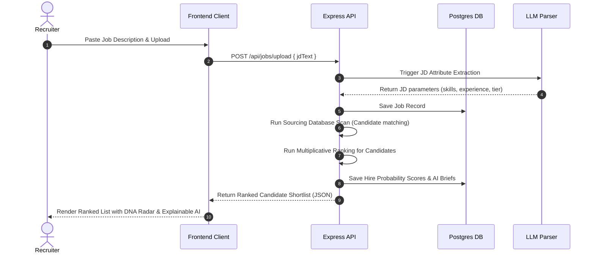
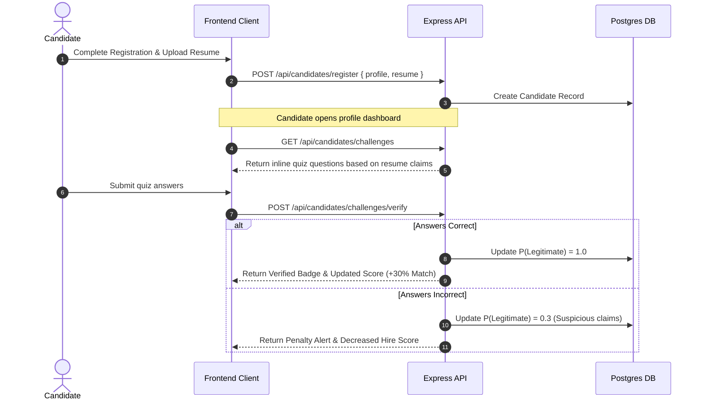

# System Architecture — HireMind Elite

This document details the multi-layered system architecture of the HireMind Elite platform. HireMind is structured as a decoupled web application leveraging a static Next.js Single Page Application (SPA) on the frontend, an Express API server on the backend, and a PostgreSQL database mapped via Prisma ORM.

---

## 1. System Topology

HireMind is designed with a service-oriented architectural model. The layout contains three primary layers:
1.  **Client Presentation Layer**: A fast, client-side application served statically and enhanced with dynamic visual charts (Chart.js), responsive animations (CSS transitions), and a theme engine.
2.  **Application Controller Layer**: Rest API server orchestrating endpoints, executing business validations, mapping database transactions, and interfacing with LLM systems.
3.  **AI & Scoring Engine**: The core intelligence pipeline that processes JDs, parses candidate attributes, calculates probability ratios, and evaluates integrity.

```mermaid
graph TD
    subgraph Client Layer (Frontend SPA)
        A[index.html / CSS / HTML] --> B[landing.js - Auth & Modals]
        A --> C[app.js - Dashboard Views]
        C --> D[Chart.js / Lucide Icons]
        C --> E[Three.js Brain Canvas]
    end

    subgraph Service Layer (Backend API)
        F[Express Router] --> G[Candidate Router]
        F --> H[Recruiter Router]
        F --> I[AI Intelligence Router]
        I --> J[Ranking Engine TS]
        J --> K[Gemini / OpenAI Services]
    end

    subgraph Persistence Layer (Database)
        G --> L[Prisma Client]
        H --> L
        L --> M[(PostgreSQL Database)]
    end

    Client Layer -- REST / HTTPS --> Service Layer
```

---

## 2. Layered Responsibilities

### Frontend Layer
- **Rewrite Setup**: Next.js uses a rewrite rule (`/` -> `/index.html`) to serve the SPA. This enables client-side routing via URL hash changes (`#dashboard`, `#candidates`, `#dna`) while avoiding server-side hydration overhead.
- **State Preservation**: The frontend persists login tokens, portal modes (`recruiter` or `candidate`), and onboarding workflows directly in browser `localStorage`.
- **Component Views**:
  - `landing-view`: The product front-door, containing auth gates, trust banners, feature reviews, and plans.
  - `dashboard-view` / `candidates-view`: The workspace for recruiters to manage pipeline health and run intelligence scans.
  - `candidate-dashboard-view`: The candidate workspace to check roadmap items, challenge quizzes, and job matches.
  - `recommendation-view`: The explainable AI breakdown displaying the multiplicative equations.

### Backend Layer
- **REST Endpoints**: Express exposes endpoints to query candidate indexes, filter hidden gems, trigger JD parsing, and fetch intelligence reports.
- **Prisma Client**: Acts as the database abstractions layer. TypeScript models map the SQL schema, assuring compile-time query safety.
- **Scoring Pipeline**: Evaluates the six probability metrics. The calculations are processed within typescript helper classes (`backend/src/services/rankingEngine.ts`) before saving output parameters to the Database.

### AI Engine Layer
- **Prompt Isolation**: System instructions are structured cleanly in isolated prompt templates, ensuring deterministic candidate briefs.
- **Multiplicative Product Calculations**: Integrates probability distributions. Rather than adding weights linearly, it multiplies variables. A critical fraud flags drops $P(Legitimate)$ to $0.10$, collapsing the final score and highlighting risks to recruiters.

---

## 3. Data Flow Diagrams

### Candidate Scoring & Sourcing Flow


### Candidate Onboarding & Verification Flow


---

## 4. DB Entity Schema
HireMind stores data model representations using standard PostgreSQL schemas:
*   `User`: Base auth profile (email, password hash, role).
*   `CandidateProfile`: Career stats, resume URL, parsed skill list, and current P-factor scores.
*   `JobAd`: Sourced JDs, experience thresholds, and priority skill structures.
*   `Shortlist`: Many-to-many relationship mapping candidate ratings to specific job ads.
*   `Notification`: System notifications, re-match alerts, and roadmap progress updates.