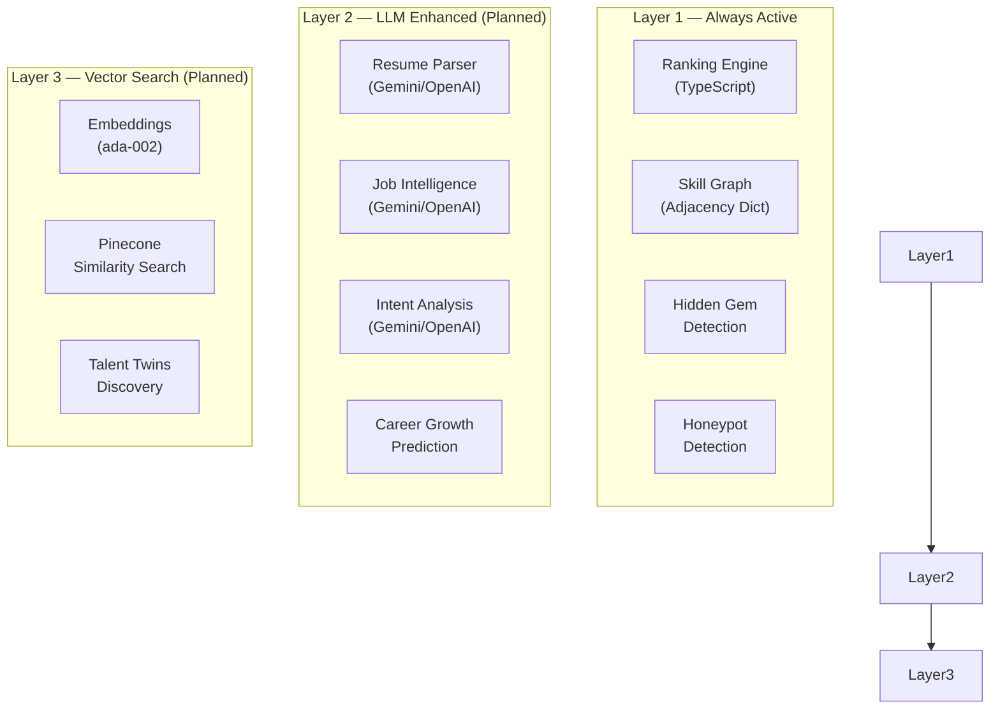

# AI Engine

> **A deep technical dive into the intelligence systems powering HireMind Elite's candidate evaluation, matching, and career prediction capabilities.**

---

## Table of Contents

- [Overview](#overview)
- [ETV-RAVE Framework](#etv-rave-framework)
- [Resume Parser](#resume-parser)
- [Semantic Matching](#semantic-matching)
- [Skill Graph](#skill-graph)
- [Candidate DNA](#candidate-dna)
- [Job Intelligence](#job-intelligence)
- [Domain Detection](#domain-detection)
- [Career Growth Prediction](#career-growth-prediction)
- [Learning Velocity](#learning-velocity)
- [Hidden Gem Detection](#hidden-gem-detection)
- [Honeypot Detection](#honeypot-detection)
- [Explainable AI](#explainable-ai)
- [Confidence Engine](#confidence-engine)
- [Prompt Engineering](#prompt-engineering)
- [Integration Status](#integration-status)

---

## Overview

HireMind's AI engine is not a single model — it is a **layered intelligence system** composed of:

1. **Deterministic algorithms** — fast, explainable, no external API required
2. **LLM integrations** — Gemini 1.5 and/or OpenAI GPT-4o for natural language understanding
3. **Vector search** — Pinecone for semantic similarity at scale

The design philosophy is **progressive enhancement**: the core ranking engine works fully without LLMs. AI integrations add richer understanding on top.



---

## ETV-RAVE Framework

The ETV-RAVE framework is HireMind's structured evaluation protocol. It maps each evaluation dimension to a probability factor:

| Letter | Dimension | P-Factor | Description |
|---|---|---|---|
| **E** | Execution Competency | P(Qualified) | Can they do the job technically? |
| **T** | Tenure & Stability | P(Available) | Are they available and stable? |
| **V** | Velocity & Growth | P(Growth) | Are they improving over time? |
| **R** | Responsiveness | P(Engageable) | Will they respond to outreach? |
| **A** | Authenticity & Integrity | P(Legitimate) | Are their claims trustworthy? |
| **V** | Variety & Scrappiness | P(Scrappiness) | Do they show initiative beyond the resume? |
| **E** | Explainable AI | — | Every score comes with a human-readable reason |

---

## Resume Parser

**Purpose**: Extract structured data from raw resume text.  
**Status**: Placeholder (LLM integration planned)

### Input
Raw resume text (plain text extracted from PDF/DOC)

### Output

```json
{
  "skills": ["React", "TypeScript", "Node.js"],
  "experience": [
    {
      "title": "Senior Engineer",
      "company": "Acme Corp",
      "duration": "3 yr",
      "highlights": ["Led team of 5", "Built scalable API"]
    }
  ],
  "education": [
    { "degree": "B.Tech CS", "institution": "IIT", "year": 2019 }
  ],
  "summary": "Experienced full-stack engineer...",
  "seniorityLevel": "Senior"
}
```

### Planned Integration

The LLM is instructed with strict XML-structured prompts to return JSON only, preventing hallucination drift:

```xml
<instruction>
  You are an elite recruiting analyst. 
  Extract structured data from the following resume.
  Return ONLY valid JSON following this exact schema.
  Do not invent information not present in the resume.
</instruction>
```

### API Endpoint
```
POST /api/ai/analyze-resume
```

---

## Semantic Matching

**Purpose**: Match resume content to job requirements using meaning, not just keywords.

### Current Implementation

The `rankingEngine.ts` implements two-tier matching:

1. **Exact Match** — normalized skill string comparison
2. **Adjacent Match** — technology equivalence dictionary

```typescript
function areSkillsAdjacent(skillA: string, skillB: string): boolean {
  const normA = normalizeSkill(skillA);
  const normB = normalizeSkill(skillB);
  if (normA === normB) return true;
  if (skillAdjacencies[normA]?.includes(normB)) return true;
  if (skillAdjacencies[normB]?.includes(normA)) return true;
  return false;
}
```

### Planned Enhancement

- **Sentence-level semantic matching** via OpenAI embeddings
- JD sentence: "Experience with cloud infrastructure" → matches "GCP", "Azure", "Terraform"
- Enables matching conceptual experience without exact keyword coverage

---

## Skill Graph

**Purpose**: Map relationships between technologies to enable fair, non-keyword matching.

### Current Skill Adjacency Dictionary

```typescript
const skillAdjacencies = {
  react:      ['vue', 'svelte', 'angular', 'solidjs'],
  vue:        ['react', 'svelte', 'angular'],
  aws:        ['gcp', 'azure', 'cloud'],
  gcp:        ['aws', 'azure', 'cloud'],
  kubernetes: ['docker', 'nomad', 'ecs', 'swarm'],
  docker:     ['kubernetes', 'containerization'],
  mongodb:    ['postgresql', 'mysql', 'dynamodb', 'nosql'],
  postgresql: ['mysql', 'sqlite', 'mongodb', 'oracle'],
  python:     ['r', 'julia', 'matlab'],
  go:         ['rust', 'c++', 'java', 'python'],
  tailwind:   ['sass', 'scss', 'css', 'bootstrap'],
};
```

### Future: Graph-Based Skill Network

Replace the static dictionary with a dynamic skill graph where:
- Nodes = skills/technologies
- Edges = similarity/transferability weights
- Weights updated from industry job postings and hiring outcomes

---

## Candidate DNA

**Purpose**: A multi-dimensional competency fingerprint for every candidate.

### DNA Dimensions

| Dimension | What It Measures |
|---|---|
| `technicalDepth` | Engineering sophistication and architectural thinking |
| `problemSolving` | Analytical reasoning and debugging capability |
| `leadership` | Team influence, mentoring, decision authority |
| `communication` | Clarity, articulation, writing quality |
| `creativity` | Novel problem approaches and innovation signals |
| `adaptability` | Technology breadth, context switching, role flexibility |
| `domainExpertise` | Depth in a specific industry or technology domain |
| `growthTrajectory` | Speed and consistency of career advancement |

### DNA Visualization

The DNA is rendered as a **radar chart** on both recruiter and candidate dashboards, providing an instant visual "shape" of the candidate's capability profile.

### API Endpoint
```
POST /api/ai/generate-dna
Body: { candidateId }
```

---

## Job Intelligence

**Purpose**: Extract deep semantic structure from job descriptions.

### Extracted Information

1. **Required skills** — hard requirements
2. **Nice-to-have skills** — bonus qualifications
3. **Experience threshold** — inferred from title seniority
4. **Team culture signals** — language analysis for culture fit
5. **Role scope** — IC contributor vs. manager vs. hybrid

### JD Embedding

The job description is converted to a vector embedding stored in `Job.embedding`. This enables:
- Semantic candidate search across the full candidate pool
- Future JD similarity clustering

---

## Domain Detection

**Purpose**: Identify the industry and technical domain of a candidate's expertise.

### Detected Domains

- **Frontend Engineering** — React, Vue, CSS, UX
- **Backend Engineering** — Node.js, Python, Go, APIs
- **Full-Stack** — Cross-layer competency
- **DevOps/Infrastructure** — Kubernetes, Docker, Terraform
- **Data Science / ML** — Python, R, TensorFlow, PyTorch
- **Mobile** — React Native, Flutter, Swift
- **Security** — OWASP, penetration testing, compliance
- **Management** — People leadership, OKRs, roadmap ownership

Domain detection influences `domainExpertise` in CandidateDNA and improves matching for specialized roles.

---

## Career Growth Prediction

**Purpose**: Predict a candidate's career level trajectory over 12–24 months.

### Stored in `TruePotential`

| Field | Description |
|---|---|
| `currentLevel` | Current inferred seniority |
| `predictedLevel` | Predicted level at `timeframeMonths` |
| `potentialScore` | 0–1 probability of reaching predicted level |
| `growthFactors` | Evidence behind the prediction |
| `careerTrajectory` | Milestone roadmap |

### Prediction Signals

- Role title progression over time
- Company type transitions (startup → scale-up → enterprise)
- Skill breadth expansion year over year
- Portfolio project complexity trend
- Certification and learning activity

---

## Learning Velocity

**Purpose**: Measure the rate at which a candidate acquires new skills and responsibilities.

### Measurement Approach

Learning velocity is calculated from the candidate's experience timeline:
- **Time between role transitions**
- **Skill set delta between consecutive roles**
- **Seniority jump magnitude**

A candidate who went from `Junior → Senior in 2 years` has higher velocity than one who spent `4 years as a mid-level developer`.

### Impact on Scoring

Learning velocity feeds directly into:
- `careerTrajectory` dimension
- `growthTrajectory` in CandidateDNA
- `P(Growth)` factor in the hire probability

---

## Hidden Gem Detection

**Purpose**: Surface highly capable candidates who would be filtered out by traditional ATS due to non-matching keywords.

### Detection Criteria

A candidate is flagged as a **Hidden Gem** when all three conditions are met:

1. **Low exact keyword match** — candidate does not exactly match 2+ required skills
2. **High adjacent match** — candidate has 2+ equivalent technology competencies
3. **High trajectory** — career growth score ≥ 90 (fast mover, high potential)

```
Hidden Gem Score = 50 (base)
  + 25 (if adjacentCount >= 2)
  + 25 (if potentialScore >= 90)

Is Hidden Gem = (score >= 85)
```

### UI Treatment

Hidden gems receive a **💎 badge** on the recruiter dashboard, with an AI-generated explanation like:

> *"While Ana lacks direct React experience, her Vue.js + Svelte proficiency and outstanding career velocity make her an excellent candidate for rapid onboarding."*

---

## Honeypot Detection

**Purpose**: Identify resumes that appear to have been keyword-stuffed to game ATS systems.

### Detection Signals

**Signal 1: Perfect keyword mirror**
If a candidate lists *exactly* every skill from the job description with no additional skills, it's suspicious.

```
jobSkills = ["React", "TypeScript", "PostgreSQL"]
candidateSkills = ["React", "TypeScript", "PostgreSQL"]  // No extra skills → suspicious
```

**Signal 2: Verbatim JD copy**
If the candidate's resume summary contains the first 50+ characters of the job description verbatim, it's flagged.

### Penalty

When honeypot is detected:
- `P(Legitimate)` collapses to `0.10`
- A **🚨 CRITICAL** risk flag is surfaced to the recruiter
- Final hire probability drops to near-zero regardless of other scores

---

## Explainable AI

**Purpose**: Ensure every score has a human-readable justification visible to recruiters.

### Explanation Types

**Standard Explanation**:
> *"[Name] shows a robust 72% hire probability score, with strong scores in Qualification (87%) and Legitimacy (95%). Trajectory and intent scores indicate high readiness for this role."*

**Hidden Gem Explanation**:
> *"[Name] is classified as a Hidden Gem. While lacking direct keywords like AWS, they demonstrate excellent competence in GCP and Azure and high potential for quick onboarding."*

**Honeypot Alert**:
> *"Honeypot Alert: This candidate's profile matches the job requirements perfectly without any adjacent or outside skills, indicating automated keyword stuffing. Legitimate rating was dropped to 10%."*

### Reasoning in Database

Explanations are stored in `Application.aiExplanation` (Text field) and rendered in:
- Recruiter candidate cards
- Export XLSX `AI Summary` column
- Candidate profile view

---

## Confidence Engine

**Purpose**: Calculate and communicate certainty levels for AI predictions.

### Multi-Factor Confidence

The hire probability itself serves as the primary confidence metric. Supporting confidence signals:

| Signal | High Confidence | Low Confidence |
|---|---|---|
| Profile completeness | All fields filled | Missing experience or skills |
| Verification status | Challenge VERIFIED | PENDING or FAILED |
| Data richness | LinkedIn + GitHub + portfolio | Resume only |
| Scoring consistency | All P-factors aligned | High variance across factors |

---

## Prompt Engineering

HireMind uses structured XML-wrapped prompts with strict JSON schema enforcement.

### Resume Extraction Prompt Structure

```
<system>
You are an elite recruiting analyst with 20 years of experience.
Extract candidate data from the resume below.
Return ONLY valid JSON. Do not fabricate information.
Follow this schema exactly.
</system>

<schema>
{
  "skills": string[],
  "experience": ExperienceObject[],
  "education": EducationObject[],
  "summary": string,
  "seniorityLevel": "Junior" | "Mid" | "Senior" | "Lead" | "Principal"
}
</schema>

<resume>
[RESUME TEXT]
</resume>
```

### JD Extraction Prompt Structure

```
<system>
You are an elite job requirements analyst.
Extract structured requirements from the job description below.
Return ONLY valid JSON.
</system>

<schema>
{
  "title": string,
  "experienceYears": number,
  "requiredSkills": string[],
  "niceToHave": string[],
  "seniority": string
}
</schema>

<jd>
[JOB DESCRIPTION TEXT]
</jd>
```

---

## Integration Status

| AI Feature | Status | API |
|---|---|---|
| Resume Text Analysis | 🔄 Planned | OpenAI / Gemini |
| JD Parsing | 🔄 Planned | Gemini |
| DNA Generation | ⚡ Heuristic + Placeholder | Custom |
| Intent Analysis | 🔄 Planned | Gemini |
| Authenticity Challenge | ⚡ Template-based | Custom |
| Future Role Matching | 🔄 Planned | LLM |
| Semantic Embeddings | 🔄 Planned | OpenAI ada-002 |
| **6-Factor Ranking** | ✅ **Fully Active** | TypeScript |
| **Hidden Gem Detection** | ✅ **Fully Active** | TypeScript |
| **Honeypot Detection** | ✅ **Fully Active** | TypeScript |

---

## Related Documentation

- [Scoring Engine](SCORING_ENGINE.md) — P-factor formulas
- [Matching Engine](MATCHING_ENGINE.md) — Semantic matching logic
- [Data Pipeline](DATA_PIPELINE.md) — Resume-to-ranking flow
- [API Reference](../api/API_REFERENCE.md) — AI endpoint specs
