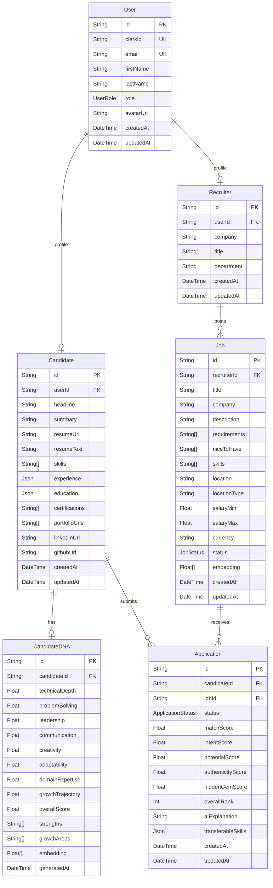
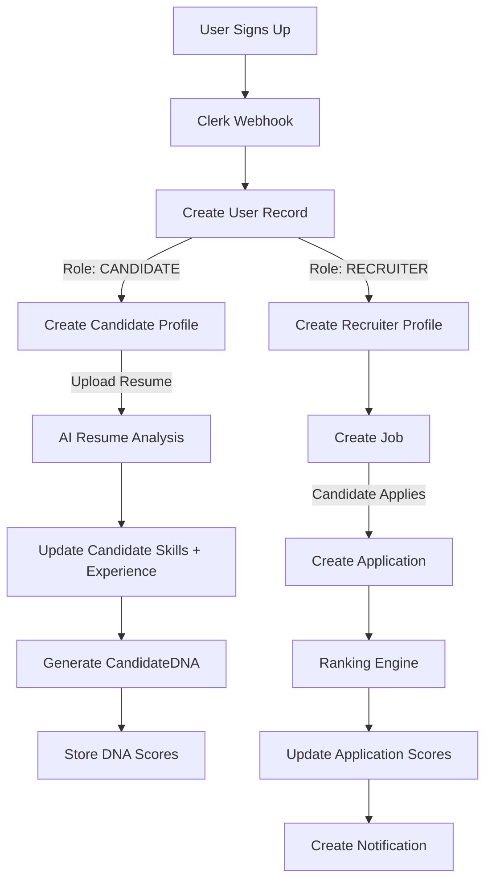

# Database Schema

> **Complete reference for all database tables, relationships, indexes, and data flow in HireMind Elite.**

---

## Table of Contents

- [Overview](#overview)
- [ORM & Database Stack](#orm--database-stack)
- [Entity Relationship Diagram](#entity-relationship-diagram)
- [Model Reference](#model-reference)
  - [User](#user)
  - [Candidate](#candidate)
  - [Recruiter](#recruiter)
  - [Job](#job)
  - [Application](#application)
  - [CandidateDNA](#candidatedna)
  - [IntentAnalysis](#intentanalysis)
  - [TruePotential](#truepotential)
  - [HiddenGemAnalysis](#hiddengemanalysis)
  - [AuthenticityChallenge](#authenticitychallenge)
  - [TalentTwin](#talenttwin)
  - [FutureMatch](#futurematch)
  - [LearningRoadmap](#learningroadmap)
  - [Notification](#notification)
- [Enumerations](#enumerations)
- [Indexes](#indexes)
- [Data Flow](#data-flow)
- [Future Scaling](#future-scaling)

---

## Overview

HireMind's database is designed around three core entities:

1. **Users** — authentication identity (synced with Clerk)
2. **Candidates** — job seekers and their AI-enriched profiles
3. **Jobs** — job listings posted by recruiters

These entities connect through **Applications**, which are enriched by a constellation of AI analysis models.

---

## ORM & Database Stack

| Component | Technology |
|---|---|
| **Database** | PostgreSQL 14+ |
| **ORM** | Prisma |
| **Schema File** | `backend/prisma/schema.prisma` |
| **Client** | `@prisma/client` (auto-generated) |
| **Migrations** | Prisma Migrate |

---

## Entity Relationship Diagram



---

## Model Reference

### User

The root identity record. Created on Clerk webhook after user registration.

| Column | Type | Constraints | Description |
|---|---|---|---|
| `id` | String | PK, UUID | Internal ID |
| `clerkId` | String | UNIQUE | Clerk user ID (synced) |
| `email` | String | UNIQUE | User email address |
| `firstName` | String | — | First name |
| `lastName` | String | — | Last name |
| `role` | UserRole | Default: CANDIDATE | Access role |
| `avatarUrl` | String? | Optional | Profile avatar URL |
| `createdAt` | DateTime | Auto | Record creation timestamp |
| `updatedAt` | DateTime | Auto | Last update timestamp |

**Indexes**: `clerkId`, `email`

---

### Candidate

Extended profile for job seekers.

| Column | Type | Description |
|---|---|---|
| `id` | String (PK) | Unique candidate ID |
| `userId` | String (FK) | References User |
| `headline` | String? | Professional tagline |
| `summary` | Text? | About / bio text |
| `resumeUrl` | String? | Uploaded resume file URL |
| `resumeText` | Text? | Extracted plain text from resume |
| `skills` | String[] | Array of skill tags |
| `experience` | Json | Array of experience objects |
| `education` | Json | Array of education objects |
| `certifications` | String[] | Certification list |
| `portfolioUrls` | String[] | Portfolio / project URLs |
| `linkedinUrl` | String? | LinkedIn profile URL |
| `githubUrl` | String? | GitHub profile URL |

**Relations**: `CandidateDNA`, `Application[]`, `IntentAnalysis[]`, `TruePotential`, `HiddenGemAnalysis[]`, `AuthenticityChallenge[]`, `TalentTwin[]`, `FutureMatch[]`, `LearningRoadmap[]`

**Experience JSON Schema**:
```json
[
  {
    "title": "Senior Engineer",
    "company": "Acme Corp",
    "duration": "3 yr",
    "highlights": ["Led migration to microservices", "Mentored 4 engineers"]
  }
]
```

**Education JSON Schema**:
```json
[
  {
    "degree": "B.Tech Computer Science",
    "institution": "IIT Bombay",
    "year": 2019
  }
]
```

---

### Recruiter

Extended profile for hiring managers.

| Column | Type | Description |
|---|---|---|
| `id` | String (PK) | Unique recruiter ID |
| `userId` | String (FK) | References User |
| `company` | String | Company name |
| `title` | String? | Job title |
| `department` | String? | Department name |

**Relations**: `Job[]`

---

### Job

Job listings posted by recruiters.

| Column | Type | Description |
|---|---|---|
| `id` | String (PK) | Unique job ID |
| `recruiterId` | String (FK) | References Recruiter |
| `title` | String | Job title |
| `company` | String | Company name |
| `description` | Text | Full job description |
| `requirements` | String[] | Required qualifications |
| `niceToHave` | String[] | Preferred qualifications |
| `skills` | String[] | Required skill tags |
| `location` | String | Location string |
| `locationType` | String | `REMOTE`, `HYBRID`, `ONSITE` |
| `salaryMin` | Float? | Minimum salary |
| `salaryMax` | Float? | Maximum salary |
| `currency` | String | Salary currency (default: USD) |
| `status` | JobStatus | `DRAFT`, `ACTIVE`, `PAUSED`, `CLOSED` |
| `embedding` | Float[] | Semantic embedding vector |

**Indexes**: `recruiterId`, `status`

---

### Application

The central link between a Candidate and a Job. Stores all AI-generated scores.

| Column | Type | Description |
|---|---|---|
| `id` | String (PK) | Unique application ID |
| `candidateId` | String (FK) | References Candidate |
| `jobId` | String (FK) | References Job |
| `status` | ApplicationStatus | Application pipeline stage |
| `matchScore` | Float | Final hire probability score (0–100) |
| `intentScore` | Float | Behavioral intent score (0–100) |
| `potentialScore` | Float | Growth potential score (0–100) |
| `authenticityScore` | Float | Verification/credibility score (0–100) |
| `hiddenGemScore` | Float | Hidden gem score (0–100) |
| `overallRank` | Int | Rank position among applicants |
| `aiExplanation` | Text | AI-generated recruiter brief |
| `transferableSkills` | Json | Array of transferable skill assessments |

**Unique Constraint**: `(candidateId, jobId)` — one application per candidate per job.

**Indexes**: `candidateId`, `jobId`, `status`

---

### CandidateDNA

Multi-dimensional competency profile. Generated once per candidate, updated on re-analysis.

| Column | Type | Description |
|---|---|---|
| `technicalDepth` | Float | Engineering depth score (0–1) |
| `problemSolving` | Float | Analytical reasoning score |
| `leadership` | Float | Leadership signal score |
| `communication` | Float | Communication effectiveness |
| `creativity` | Float | Creative problem-solving |
| `adaptability` | Float | Adaptability to new environments |
| `domainExpertise` | Float | Domain-specific expertise |
| `growthTrajectory` | Float | Career progression velocity |
| `overallScore` | Float | Weighted overall DNA score |
| `strengths` | String[] | Top identified strengths |
| `growthAreas` | String[] | Areas recommended for growth |
| `embedding` | Float[] | Vector embedding for semantic search |

---

### IntentAnalysis

Per-application intent signal analysis.

| Column | Type | Description |
|---|---|---|
| `intentScore` | Float | Overall intent score |
| `signals` | Json | Array of intent signal objects |
| `genuineInterest` | Float | Genuine role interest indicator |
| `culturalAlignment` | Float | Culture fit score |
| `longTermFit` | Float | Long-term retention likelihood |
| `analysis` | Text | AI-generated intent summary |

---

### TruePotential

Career growth prediction for a candidate.

| Column | Type | Description |
|---|---|---|
| `currentLevel` | String | Current seniority level |
| `predictedLevel` | String | Predicted future level |
| `timeframeMonths` | Int | Months to reach predicted level |
| `potentialScore` | Float | Potential score (0–1) |
| `growthFactors` | Json | Array of contributing growth factors |
| `careerTrajectory` | Json | Projected career path milestones |

---

### HiddenGemAnalysis

Identifies candidates with unconventional but strong backgrounds.

| Column | Type | Description |
|---|---|---|
| `gemScore` | Float | Hidden gem probability score |
| `transferableSkills` | Json | Adjacent/transferable skill analysis |
| `unconventionalStrengths` | String[] | Non-traditional strengths |
| `adjacentExperience` | String[] | Experience in adjacent domains |

---

### AuthenticityChallenge

Resume verification quiz system.

| Column | Type | Description |
|---|---|---|
| `questions` | Json | Array of generated challenge questions |
| `overallScore` | Float | Challenge completion score |
| `knowledgeConfidence` | Float | Confidence in claimed knowledge |
| `status` | VerificationStatus | `PENDING`, `VERIFIED`, `FAILED`, `CHALLENGED` |
| `completedAt` | DateTime? | Completion timestamp |

---

### TalentTwin

Similarity mapping between two candidates.

| Column | Type | Description |
|---|---|---|
| `candidateId` | String (FK) | Source candidate |
| `twinCandidateId` | String (FK) | Similar candidate |
| `similarityScore` | Float | Similarity score (0–1) |
| `sharedStrengths` | String[] | Common strengths |
| `differentiators` | String[] | Key differentiating traits |

---

### FutureMatch

Predicted future job role matches for a candidate.

| Column | Type | Description |
|---|---|---|
| `predictedRole` | String | Forecasted future role title |
| `predictedCompany` | String? | Predicted company type |
| `matchProbability` | Float | Prediction confidence (0–1) |
| `requiredGrowth` | String[] | Skills to develop |
| `timeframeMonths` | Int | Months to readiness |

---

### LearningRoadmap

Personalized skill development plan for candidates.

| Column | Type | Description |
|---|---|---|
| `title` | String | Roadmap title |
| `milestones` | Json | Ordered milestone objects |
| `targetRole` | String | Target job title |
| `estimatedWeeks` | Int | Estimated weeks to complete |
| `progress` | Float | Completion percentage (0–1) |

---

### Notification

In-app notification system for both user types.

| Column | Type | Description |
|---|---|---|
| `type` | NotificationType | `MATCH`, `STATUS_UPDATE`, `CHALLENGE`, `LEARNING`, `SYSTEM`, `FUTURE_ROLE` |
| `title` | String | Notification title |
| `message` | Text | Notification body |
| `read` | Boolean | Read/unread status |
| `actionUrl` | String? | Optional deep link URL |

---

## Enumerations

| Enum | Values |
|---|---|
| `UserRole` | `RECRUITER`, `CANDIDATE`, `ADMIN` |
| `JobStatus` | `DRAFT`, `ACTIVE`, `PAUSED`, `CLOSED` |
| `ApplicationStatus` | `APPLIED`, `SCREENING`, `INTERVIEW`, `OFFER`, `HIRED`, `REJECTED`, `SECOND_CHANCE` |
| `VerificationStatus` | `PENDING`, `VERIFIED`, `FAILED`, `CHALLENGED` |
| `NotificationType` | `MATCH`, `STATUS_UPDATE`, `CHALLENGE`, `LEARNING`, `SYSTEM`, `FUTURE_ROLE` |

---

## Indexes

All performance-critical foreign keys and filter columns are indexed:

| Table | Index Columns |
|---|---|
| `User` | `clerkId`, `email` |
| `Candidate` | `userId` |
| `Recruiter` | `userId` |
| `Job` | `recruiterId`, `status` |
| `Application` | `candidateId`, `jobId`, `status` |
| `CandidateDNA` | `candidateId`, `overallScore` |
| `IntentAnalysis` | `candidateId`, `jobId` |
| `AuthenticityChallenge` | `candidateId`, `status` |
| `Notification` | `userId`, `read` |

---

## Data Flow



---

## Future Scaling

| Scaling Need | Planned Solution |
|---|---|
| Vector search at scale | Migrate to dedicated Pinecone / pgvector |
| High-volume notifications | Redis pub/sub or message queue |
| Read performance | PostgreSQL read replicas |
| Analytics queries | Separate analytics DB or Redshift |
| Session caching | Redis for frequent profile reads |
| Multi-tenancy | Row-level security (RLS) in PostgreSQL |

---

## Related Documentation

- [System Architecture](SYSTEM_ARCHITECTURE.md) — System-level design
- [Data Pipeline](DATA_PIPELINE.md) — Resume to ranking data flow
- [AI Engine](AI_ENGINE.md) — How AI enriches database records
- [Security](SECURITY.md) — Data privacy and access controls
