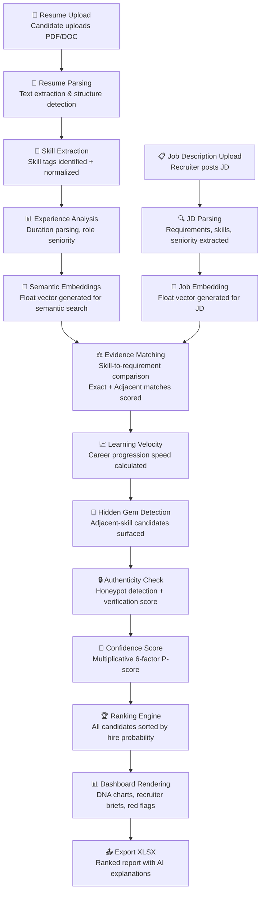
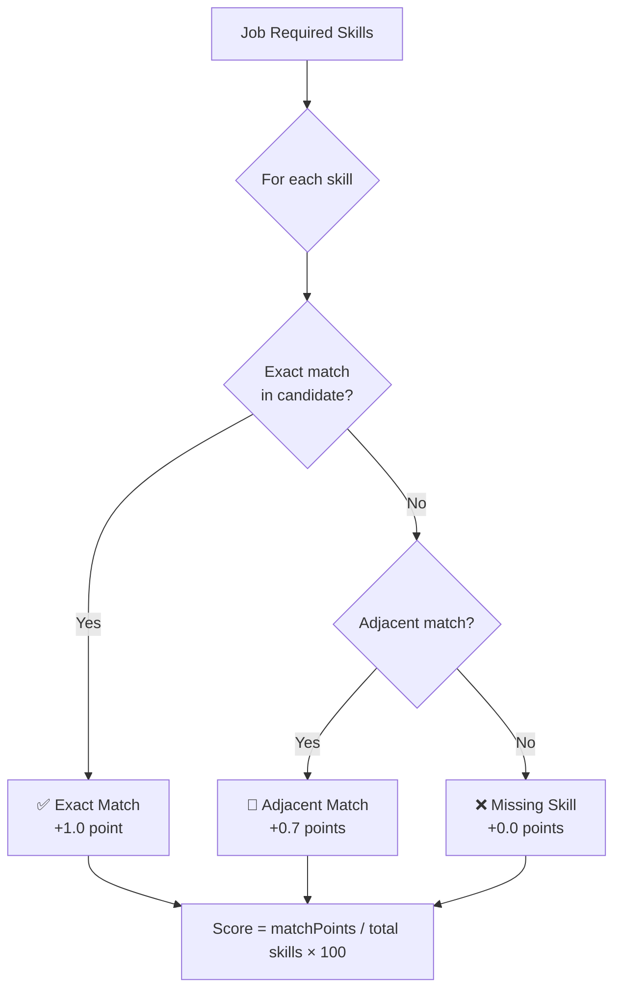

# AI Data Pipeline

> **The complete journey of a resume from raw upload to an evidence-driven hire probability score.**

---

## Table of Contents

- [Overview](#overview)
- [Pipeline Stages](#pipeline-stages)
- [Full Pipeline Flowchart](#full-pipeline-flowchart)
- [Stage 1 — Resume Upload](#stage-1--resume-upload)
- [Stage 2 — Resume Parsing](#stage-2--resume-parsing)
- [Stage 3 — Skill Extraction](#stage-3--skill-extraction)
- [Stage 4 — Experience Analysis](#stage-4--experience-analysis)
- [Stage 5 — Semantic Embeddings](#stage-5--semantic-embeddings)
- [Stage 6 — Job Description Parsing](#stage-6--job-description-parsing)
- [Stage 7 — Evidence Matching](#stage-7--evidence-matching)
- [Stage 8 — Learning Velocity Detection](#stage-8--learning-velocity-detection)
- [Stage 9 — Hidden Gem Detection](#stage-9--hidden-gem-detection)
- [Stage 10 — Confidence Score](#stage-10--confidence-score)
- [Stage 11 — Ranking Engine](#stage-11--ranking-engine)
- [Stage 12 — Dashboard Rendering](#stage-12--dashboard-rendering)
- [Stage 13 — Export XLSX](#stage-13--export-xlsx)
- [Error Handling](#error-handling)

---

## Overview

The HireMind AI pipeline transforms unstructured resume text into a precise, explainable **Hire Probability Score** through 13 deterministic and AI-enhanced stages.

The pipeline is designed with three principles:
1. **Explainability** — every score has a plain-language reason
2. **Evidence-driven** — no black-box scoring, all dimensions are auditable
3. **Fairness** — adjacent skills recognized, pedigree-bias eliminated

---

## Full Pipeline Flowchart



---

## Stage 1 — Resume Upload

**Input**: PDF or text document from candidate  
**Output**: Raw text content stored in database

### Process

1. Candidate navigates to their dashboard and clicks **Upload Resume**
2. The file is sent to the backend via multipart form upload
3. A document parsing service extracts raw plain text
4. The text is stored in `Candidate.resumeText` (Text field)
5. The original file URL is stored in `Candidate.resumeUrl`

### API Endpoint

```
POST /api/candidates/:id (update with resumeText)
```

---

## Stage 2 — Resume Parsing

**Input**: Raw resume text  
**Output**: Structured JSON (skills, experience, education)

### Process

The AI resume parser (powered by Gemini / OpenAI) analyzes the raw text and returns structured data:

```json
{
  "skills": ["React", "TypeScript", "Node.js", "PostgreSQL"],
  "experience": [
    {
      "title": "Senior Engineer",
      "company": "TechCorp",
      "duration": "3 yr",
      "highlights": ["Led migration to microservices"]
    }
  ],
  "education": [
    {
      "degree": "B.Tech Computer Science",
      "institution": "NIT Trichy",
      "year": 2020
    }
  ],
  "summary": "Full-stack engineer with 5 years of experience...",
  "seniorityLevel": "Senior"
}
```

### API Endpoint

```
POST /api/ai/analyze-resume
Body: { resumeText: "..." }
```

---

## Stage 3 — Skill Extraction

**Input**: Parsed resume JSON  
**Output**: Normalized skill array stored in `Candidate.skills`

### Normalization Process

```typescript
function normalizeSkill(skill: string): string {
  return skill.toLowerCase().replace(/[\s\-_]/g, '');
}

// Examples:
// "React.js" → "reactjs"
// "Node JS"  → "nodejs"
// "AWS S3"   → "awss3"
```

### Skill Adjacency Dictionary

The system maintains an adjacency map to recognize equivalent technologies:

| Skill | Adjacent Skills |
|---|---|
| `react` | `vue`, `svelte`, `angular`, `solidjs` |
| `aws` | `gcp`, `azure`, `cloud` |
| `kubernetes` | `docker`, `nomad`, `ecs` |
| `postgresql` | `mysql`, `sqlite`, `mongodb` |
| `python` | `r`, `julia`, `matlab` |
| `go` | `rust`, `c++`, `java` |

---

## Stage 4 — Experience Analysis

**Input**: Experience JSON array  
**Output**: Total years of experience (float)

### Duration Parsing Logic

The system intelligently parses varied duration formats:

```
"3 yr"       → 3.0 years
"18 mo"      → 1.5 years
"2 years"    → 2.0 years
"2020-2023"  → 3.0 years (calculated)
```

```typescript
function getExperienceYears(candidate: any): number {
  // Parses: "3 yr", "18 mo", numeric years, date ranges
  // Returns: total float years of experience
}
```

### Seniority Inference

The job title drives expected experience benchmarks:

| Title Contains | Expected Years |
|---|---|
| (no qualifier) | 2 years |
| `senior` | 5 years |
| `lead`, `principal` | 8 years |
| `director`, `vp` | 10 years |

---

## Stage 5 — Semantic Embeddings

**Input**: Resume text  
**Output**: Float vector stored in `CandidateDNA.embedding` and `Job.embedding`

### Purpose

- Enables **semantic search** beyond keyword matching
- Powers **Talent Twin** identification (similar candidate discovery)
- Future: enables **pgvector** or **Pinecone** similarity queries

### Technology

- **Current**: Placeholder float arrays (AI integration pending)
- **Planned**: OpenAI `text-embedding-ada-002` or Gemini Embeddings API

---

## Stage 6 — Job Description Parsing

**Input**: Job description text (from recruiter)  
**Output**: Structured requirements + skill tags

### Parsed Fields

```json
{
  "title": "Senior Full-Stack Engineer",
  "experienceYears": 5,
  "requiredSkills": ["React", "TypeScript", "Node.js"],
  "niceToHave": ["GraphQL", "Docker"],
  "seniority": "Senior",
  "locationType": "REMOTE"
}
```

The parsed skills are stored in `Job.skills` and used by the ranking engine.

---

## Stage 7 — Evidence Matching

**Input**: Candidate skills + Job required skills  
**Output**: Technical fit score + matched/missing skills

### Matching Algorithm



### Scoring Formula

```
matchPoints = (exactMatches × 1.0) + (adjacentMatches × 0.7)
technicalFitScore = (matchPoints / jobSkills.length) × 100
```

---

## Stage 8 — Learning Velocity Detection

**Input**: Experience timeline, role progression  
**Output**: Career trajectory score (0–100)

### What is Learning Velocity?

Learning Velocity measures how quickly a candidate advances in their career:

- **Fast mover**: Promoted from Junior → Senior in 3 years
- **Stable grower**: Consistent contributions with depth increase
- **Plateau**: Long tenure in same role without advancement

The `careerTrajectory` score in `CandidateDNA` captures this dimension.

---

## Stage 9 — Hidden Gem Detection

**Input**: Candidate skills, job skills, career trajectory  
**Output**: Hidden gem flag + gem score

### Detection Logic

A candidate is classified as a **Hidden Gem** when:

1. They lack **2+ direct skill matches** with the job
2. But have **2+ adjacent/equivalent** technology matches
3. And their **career trajectory score ≥ 90**

```typescript
const isAdjacentMatch = adjacentCount >= 2;
const isHighPotential = potentialScore >= 90;

let score = 50; // baseline
if (isAdjacentMatch) score += 25;
if (isHighPotential) score += 25;

const isGem = score >= 85;
```

### Why This Matters

Traditional ATS systems reject Hidden Gems — candidates who use Vue.js when the job asks for React, or GCP when AWS is listed. HireMind surfaces these candidates with a clear badge and explanation.

---

## Stage 10 — Confidence Score

**Input**: All 6 P-factor scores  
**Output**: Final multiplicative hire probability (0–100)

### The Multiplicative Model

```
P(Hire) = P(Q) × P(A) × P(E) × P(L) × P(G) × P(S)
```

| Factor | Code Symbol | Source |
|---|---|---|
| Qualification | P(Q) | `technicalFit × 0.7 + experienceFit × 0.3` |
| Availability | P(A) | `0.4 + intentScore × 0.4 + experienceFit × 0.2` |
| Engageability | P(E) | `0.5 + intentScore × 0.3 + communication × 0.2` |
| Legitimacy | P(L) | `credibility score` (or 0.10 if honeypot detected) |
| Growth | P(G) | `careerTrajectory × 0.8 + hiddenGemScore × 0.2` |
| Scrappiness | P(S) | `hiddenGemScore × 0.6 + careerTrajectory × 0.4` |

**Honeypot Penalty**: If the honeypot detector fires, `P(L)` collapses to `0.10`, dropping the final score dramatically regardless of other factors.

---

## Stage 11 — Ranking Engine

**Input**: All candidate RankResults for a job  
**Output**: Sorted, ranked candidate list

### Ranking Process

1. All candidates who applied to a job are fetched
2. Each candidate is run through `rankCandidate(candidate, job)`
3. Results are sorted by `match_score` descending
4. `overallRank` is assigned (1 = best)
5. Scores, reasoning, and flags are persisted to `Application`

### API Endpoint

```
POST /api/ai/rank
Body: { candidateId, jobId }

GET /api/applications/matches/:jobId
```

---

## Stage 12 — Dashboard Rendering

**Input**: Ranked application list  
**Output**: Recruiter dashboard with visual cards, DNA charts, AI briefs

### Rendered Components

- **Candidate Cards**: Rank, name, hire probability badge
- **DNA Radar Chart**: 6-dimension visual competency map
- **AI Brief**: Plain-language recruiter summary
- **Strength Tags**: Top 3 evidence-backed strengths
- **Risk Alerts**: Honeypot flags, skill gaps
- **Hidden Gem Badge**: Surfaced non-obvious candidates

---

## Stage 13 — Export XLSX

**Input**: Ranked candidate list with all scores  
**Output**: Downloadable XLSX report

### Export Fields

| Column | Source |
|---|---|
| Rank | `Application.overallRank` |
| Candidate Name | `User.firstName + lastName` |
| Email | `User.email` |
| Hire Probability | `Application.matchScore` |
| P(Qualified) | `hire_probability.qualified` |
| P(Available) | `hire_probability.available` |
| P(Legitimate) | `hire_probability.legitimate` |
| Hidden Gem | `hidden_gem` flag |
| Honeypot Risk | `honeypot_risk` flag |
| AI Summary | `Application.aiExplanation` |

### Technology

The XLSX is generated client-side using **ExcelJS** (`ExportReportModal.tsx`), creating formatted sheets with candidate data, conditional formatting, and recruiter notes.

---

## Error Handling

| Stage | Failure Scenario | Fallback |
|---|---|---|
| Resume Upload | File too large / invalid format | Return 400 error with user message |
| AI Resume Parse | LLM API timeout | Use placeholder data + log warning |
| Skill Extraction | Empty skills array | Score with 0 technical fit |
| Experience Parse | Unknown duration format | Default to 2 years |
| Ranking Engine | Missing candidate/job | Return 400 AppError |
| Export | Empty candidate list | Return empty XLSX with headers |

---

## Related Documentation

- [AI Engine](AI_ENGINE.md) — LLM prompts and reasoning
- [Matching Engine](MATCHING_ENGINE.md) — Semantic similarity logic
- [Scoring Engine](SCORING_ENGINE.md) — P-factor formula breakdown
- [Database Schema](DATABASE_SCHEMA.md) — How data is stored
- [API Reference](../api/API_REFERENCE.md) — Pipeline API endpoints
