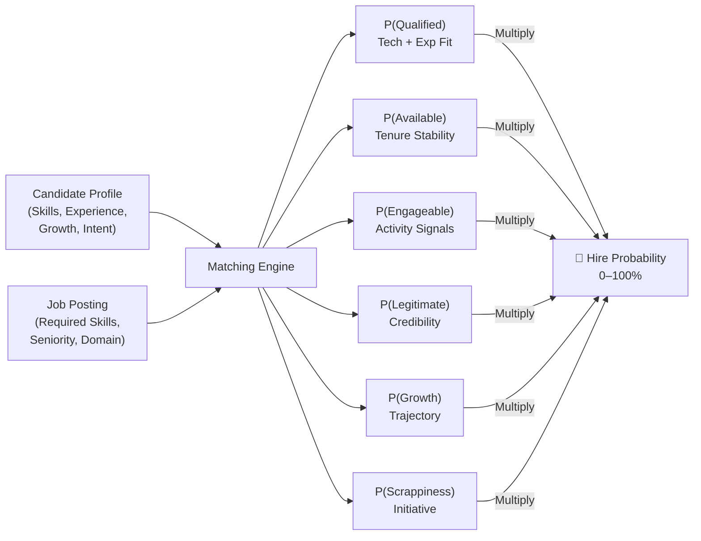
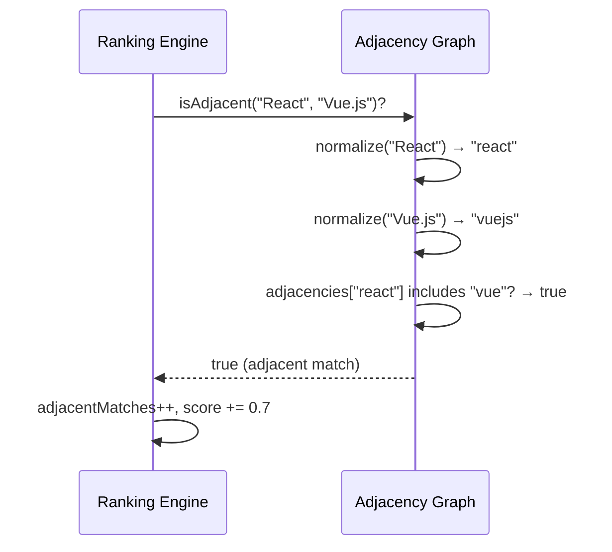
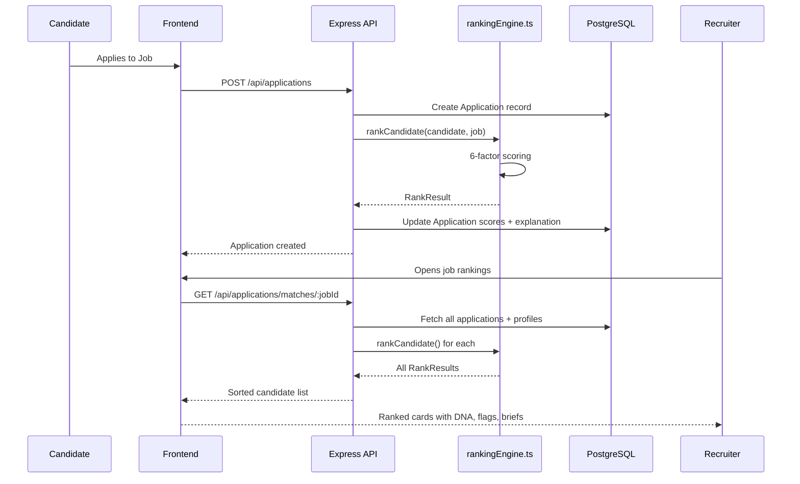

# Matching Engine

> **How HireMind identifies the most hireable candidates through evidence-driven semantic matching — and why it fundamentally beats traditional ATS keyword scanning.**

---

## Table of Contents

- [Why Traditional ATS Fails](#why-traditional-ats-fails)
- [HireMind's Matching Philosophy](#hireминds-matching-philosophy)
- [Resume Matching Overview](#resume-matching-overview)
- [Semantic Similarity](#semantic-similarity)
- [Skill Adjacency System](#skill-adjacency-system)
- [Candidate Ranking Algorithm](#candidate-ranking-algorithm)
- [Evidence Extraction](#evidence-extraction)
- [Explainability Layer](#explainability-layer)
- [Matching Workflow](#matching-workflow)
- [Comparison: ATS vs HireMind](#comparison-ats-vs-hiremind)

---

## Why Traditional ATS Fails

Modern Applicant Tracking Systems rank candidates by a simple metric: **keyword overlap**. This approach has three fundamental flaws:

### Flaw 1: Resume Gaming

Candidates learn the exact keywords used in job descriptions and stuff their resumes accordingly. A developer who has never used Kubernetes can list it and pass keyword filters because the ATS has no way to verify competence.

### Flaw 2: Pedigree Bias

ATS systems penalize non-traditional backgrounds — self-taught engineers, bootcamp graduates, career changers — even when they have equivalent or superior skills in adjacent technologies.

### Flaw 3: Static Scoring

Linear ATS scoring means a candidate with perfect skills but zero intention of switching jobs scores higher than a highly motivated candidate with 90% of the required skills. This creates wasted recruiter effort chasing candidates who won't respond.

---

## HireMind's Matching Philosophy

HireMind replaces keyword overlap with **Hire Probability** — a multiplicative score built from 6 independent evidence dimensions:

```
P(Hire) = P(Q) × P(A) × P(E) × P(L) × P(G) × P(S)
```

Key principles:
1. **Zero-Killer**: If any critical dimension collapses (e.g., suspected fraud drops P(L) to 0.10), the entire score collapses
2. **Adjacent Recognition**: Equivalent technologies count, not just exact matches
3. **Explainability**: Every score has a plain-language reason
4. **Anti-Gaming**: Honeypot detection catches keyword stuffing

---

## Resume Matching Overview

The matching process compares a **candidate profile** against a **job posting** across 6 dimensions:



---

## Semantic Similarity

### Current Implementation: Two-Tier Matching

**Tier 1: Exact Match**
Skill strings are normalized (lowercase, spaces/hyphens removed) and compared:
```
"React.js" → "reactjs"
"React"    → "react"
→ MATCH ✅
```

**Tier 2: Adjacent Match**
If no exact match, the system checks technology equivalence:
```
Job requires: "AWS"
Candidate has: "GCP"
→ Adjacent match (0.7 weight) ✅
```

Exact matches score **1.0 point**, adjacent matches score **0.7 points**.

### Planned Enhancement: Vector Similarity

The planned Layer 2 enhancement uses semantic embeddings to match concepts, not just string tokens:

- Job: *"experience with cloud infrastructure"*
- Candidate: *"deployed microservices on Kubernetes with Terraform"*
- Vector similarity: **0.87** → Strong match, even with no shared keywords

This is powered by **OpenAI `text-embedding-ada-002`** or **Gemini Embeddings**, stored in Pinecone for fast approximate nearest-neighbor search.

---

## Skill Adjacency System

The adjacency system is what separates HireMind from ATS tools that only do string matching.

### Adjacency Map

```typescript
const skillAdjacencies: Record<string, string[]> = {
  // JavaScript Frameworks
  react:      ['vue', 'vuejs', 'svelte', 'angular', 'solidjs'],
  vue:        ['react', 'svelte', 'angular'],
  svelte:     ['react', 'vue', 'angular'],

  // Cloud Providers
  aws:        ['gcp', 'googlecloud', 'azure', 'cloud'],
  gcp:        ['aws', 'azure', 'cloud'],
  azure:      ['aws', 'gcp', 'cloud'],

  // CSS Frameworks
  tailwind:   ['sass', 'scss', 'css', 'bootstrap'],
  sass:       ['tailwind', 'scss', 'css', 'bootstrap'],

  // Languages
  python:     ['r', 'julia', 'matlab'],
  go:         ['rust', 'c++', 'java', 'python'],

  // Container Orchestration
  kubernetes: ['docker', 'nomad', 'ecs', 'swarm'],
  docker:     ['kubernetes', 'containerization'],

  // Databases
  mongodb:    ['postgresql', 'mysql', 'dynamodb', 'nosql'],
  postgresql: ['mysql', 'sqlite', 'mongodb', 'oracle'],
};
```

### How Adjacency Is Used



---

## Candidate Ranking Algorithm

The `rankCandidate()` function in `rankingEngine.ts` implements the full 6-dimensional evaluation:

### Step-by-Step Execution

```
1. Extract candidate skills → normalize
2. Extract job skills → normalize
3. calculateTechnicalFit()  → { score, strengths, risks }
4. calculateExperienceFit() → number
5. calculateCareerTrajectory() → number
6. calculateBehavioralIntent() → number
7. calculateCredibility() → number
8. calculateHiddenGem() → { score, isGem }
9. detectHoneypot() → boolean
10. Compute P-factors (0.0–1.0 scale)
11. Multiply all P-factors → match_score
12. Compile strengths, risks, reasoning
13. Return RankResult
```

### RankResult Shape

```typescript
interface RankResult {
  candidate_id: string;
  match_score: number;           // Final hire probability 0-100
  rank_score: number;            // Same as match_score for sorting
  candidate_dna: CandidateDNA;   // 6 DNA dimensions
  strengths: string[];           // Top 3 evidence-backed strengths
  risks: string[];               // Top 3 risk factors
  hidden_gem: boolean;           // Hidden gem flag
  honeypot_risk: boolean;        // Honeypot flag
  reasoning: string;             // AI-generated explanation
  hire_probability: {
    qualified: number;           // P(Q)
    available: number;           // P(A)
    engageable: number;          // P(E)
    legitimate: number;          // P(L)
    growth: number;              // P(G)
    scrappiness: number;         // P(S)
    hire_score: number;          // Final score
  };
}
```

---

## Evidence Extraction

For each match or mismatch, the engine extracts evidence:

### Strength Evidence

```typescript
// Exact match
foundStrengths.push(`${reqSkill}`);
// → "Strong knowledge in React"

// Adjacent match
foundStrengths.push(`${candSkill} (equivalent to ${reqSkill})`);
// → "Strong knowledge in Vue.js (equivalent to React)"

// Experience
if (experienceFit >= 85) strengths.push('Strong professional background in related role');

// Trajectory
if (careerTrajectory >= 90) strengths.push('Outstanding career progression velocity');
```

### Risk Evidence

```typescript
// Missing skills
risks.push(`Lacks direct experience with: ${missingCritical.join(', ')}`);

// Honeypot
risks.unshift('CRITICAL: High probability of resume stuffing / Honeypot profile');

// Experience gap
if (experienceFit < 60) risks.push('Years of experience is below role guidelines');

// Credibility issue
if (credibility < 60) risks.push('Verification metrics show timeline inconsistencies');
```

---

## Explainability Layer

Every candidate receives a plain-language AI explanation tailored to their result type:

### Standard Candidate Explanation

```
[Name] shows a robust [score]% hire probability score, with strong scores in 
Qualification ([Q]%) and Legitimate check ([L]%). Trajectory and intent scores 
indicate high readiness for this role.
```

### Hidden Gem Explanation

```
[Name] is classified as a Hidden Gem. While lacking direct keywords like [skill1, skill2], 
they demonstrate excellent competence in adjacent technologies and high potential for 
quick onboarding.
```

### Honeypot Alert

```
Honeypot Alert: This candidate's profile matches the job requirements perfectly without 
any adjacent or outside skills, indicating automated keyword stuffing. Legitimate rating 
was dropped to 10% and final score penalized accordingly.
```

---

## Matching Workflow

End-to-end from application to ranked display:



---

## Comparison: ATS vs HireMind

| Feature | Traditional ATS | HireMind Elite |
|---|---|---|
| **Matching Method** | Keyword overlap | 6-factor multiplicative model |
| **Adjacent Skills** | ❌ Not recognized | ✅ Full adjacency graph |
| **Anti-Gaming** | ❌ None | ✅ Honeypot detection |
| **Hidden Gems** | ❌ Filtered out | ✅ Surfaced with explanation |
| **Availability Signal** | ❌ Ignored | ✅ P(Available) factor |
| **Credibility Check** | ❌ None | ✅ P(Legitimate) + challenge |
| **Explainability** | ❌ Black box | ✅ Plain-language brief |
| **Re-scoring** | ❌ Static | ✅ Dynamic on profile update |
| **Export** | CSV | XLSX with AI summaries |
| **Developer Access** | Closed system | ✅ Open REST API |

---

## Related Documentation

- [Scoring Engine](SCORING_ENGINE.md) — Detailed P-factor formulas
- [AI Engine](AI_ENGINE.md) — LLM integration architecture
- [Data Pipeline](DATA_PIPELINE.md) — Resume-to-score data flow
- [API Reference](../api/API_REFERENCE.md) — Ranking endpoint specs
