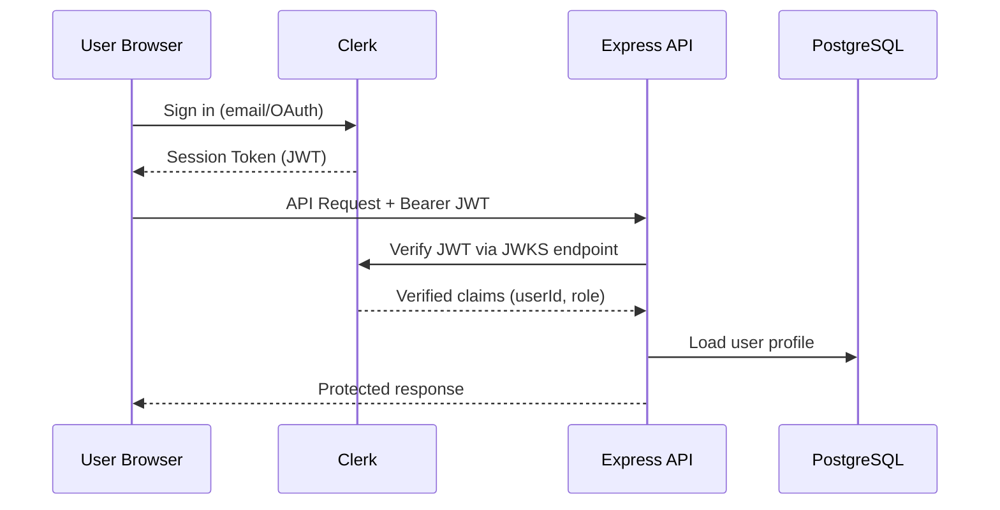

# Security

> **How HireMind Elite protects candidate data, secures API access, manages secrets, and prepares for enterprise-grade compliance.**

---

## Table of Contents

- [Overview](#overview)
- [Authentication](#authentication)
- [Authorization](#authorization)
- [Resume Privacy](#resume-privacy)
- [Secure Storage](#secure-storage)
- [Environment Variables](#environment-variables)
- [Secrets Management](#secrets-management)
- [API Security](#api-security)
- [Rate Limiting](#rate-limiting)
- [CORS Policy](#cors-policy)
- [OWASP Best Practices](#owasp-best-practices)
- [Future GDPR Compliance](#future-gdpr-compliance)
- [Security Roadmap](#security-roadmap)

---

## Overview

HireMind Elite is designed with a security-first mindset across three pillars:

1. **Identity** — Who is making this request?
2. **Authorization** — What are they allowed to do?
3. **Privacy** — How is sensitive resume and personal data protected?

---

## Authentication

Authentication is powered by **Clerk** — an enterprise-grade, SOC 2 compliant authentication provider.

### How It Works



### Key Properties

| Property | Detail |
|---|---|
| **Provider** | Clerk |
| **Token Format** | JWT (RS256 signed) |
| **Verification** | JWKS public key verification |
| **Session Storage** | Clerk-managed (httpOnly cookies + localStorage) |
| **MFA** | Supported via Clerk (optional) |
| **OAuth** | Google, GitHub (Clerk-managed) |

### Backend Middleware

Every protected API route passes through the `requireAuthentication` middleware:

```typescript
// middleware/auth.ts
router.use(requireAuthentication, attachUser);
```

The middleware:
1. Extracts the `Authorization: Bearer <token>` header
2. Verifies the JWT signature using Clerk's JWKS endpoint
3. Attaches `userId` and `role` to `req.user`
4. Rejects unauthorized requests with `401`

---

## Authorization

### Role-Based Access Control (RBAC)

| Role | Permissions |
|---|---|
| `CANDIDATE` | View jobs, apply, manage own profile, view own DNA |
| `RECRUITER` | Post/edit jobs, view candidates, generate rankings, export |
| `ADMIN` | All permissions + user management |

### Route-Level Enforcement

```typescript
// Only RECRUITER and ADMIN can create jobs
router.post('/', requireAuthentication, attachUser, requireRole('RECRUITER', 'ADMIN'), createJob);

// Only authenticated users can view candidates
router.use(requireAuthentication, attachUser);
```

### Object-Level Authorization

Candidates can only access their own profiles. Recruiters can only edit their own job postings. Enforcement is applied at the controller level by checking `req.user.id` against the resource owner.

---

## Resume Privacy

Resume data is among the most sensitive personal information in the system.

### Storage

| Data | Storage Location | Access |
|---|---|---|
| Resume file (PDF) | Object storage (URL) | Candidate + authorized recruiters |
| Resume text | `Candidate.resumeText` (PostgreSQL) | Backend only |
| Skills extracted | `Candidate.skills` (array) | Used for matching |
| AI analysis | `Application.aiExplanation` | Recruiter + candidate |

### Access Principles

- Recruiters can **view** candidate AI analysis and scores
- Recruiters **cannot directly download** raw resumes without explicit sharing (future feature)
- Candidates can **view and delete** their own resume data
- Prisma enforces cascade deletes — deleting a user deletes all their profile data

---

## Secure Storage

### Database Security

| Practice | Implementation |
|---|---|
| **Connection encryption** | PostgreSQL SSL (`sslmode=require` in production) |
| **ORM parameterization** | Prisma uses prepared statements — no raw SQL injection risk |
| **Cascade deletes** | Data is fully removed when parent records are deleted |
| **No plaintext passwords** | All auth handled by Clerk — no passwords stored in our DB |

### File Storage

Resume files are stored via URL references. In production:
- Files should be stored in **AWS S3**, **Cloudflare R2**, or **Supabase Storage**
- Access should be controlled via signed URLs with expiry
- Direct public URLs should be avoided

---

## Environment Variables

All secrets are managed via environment variables — **never hardcoded** in source code.

### Required Variables

| Variable | Sensitivity | Purpose |
|---|---|---|
| `DATABASE_URL` | 🔴 Critical | PostgreSQL connection + credentials |
| `CLERK_SECRET_KEY` | 🔴 Critical | Backend Clerk authentication |
| `OPENAI_API_KEY` | 🔴 Critical | AI API billing key |
| `GEMINI_API_KEY` | 🔴 Critical | AI API billing key |
| `PINECONE_API_KEY` | 🟡 High | Vector DB access key |
| `CLERK_PUBLISHABLE_KEY` | 🟢 Safe | Frontend-safe Clerk key |
| `NEXT_PUBLIC_API_URL` | 🟢 Safe | Frontend API endpoint |

### .gitignore Enforcement

The following files are excluded from version control:

```gitignore
backend/.env
frontend/.env.local
.env
*.env
```

> **Never commit `.env` files.** Use environment variable management in your deployment platform.

---

## Secrets Management

### Development

Use `.env` files locally (gitignored).

### Production Platforms

| Platform | Secrets Management |
|---|---|
| **Vercel** | Environment Variables panel (encrypted at rest) |
| **Railway** | Variables tab (encrypted, injected at runtime) |
| **Render** | Environment Groups (encrypted) |
| **Docker** | Use `--env-file` or Docker Secrets |
| **VPS** | `systemd` `EnvironmentFile=` or HashiCorp Vault |

### Rotation Policy

- Rotate all API keys quarterly
- Rotate after any team member offboarding
- Use separate keys for development and production environments

---

## API Security

### Input Validation

All API endpoints validate required fields and return structured `AppError` responses:

```typescript
if (!message) {
  throw new AppError('Message is required', 400);
}
```

### Error Handling

The global error handler (`middleware/errorHandler.ts`) ensures:
- Stack traces are **never exposed** in production responses
- Errors return structured JSON, not HTML error pages
- Unexpected errors return generic `500` messages

### Prepared Statements

All database queries use Prisma's query builder — no raw SQL concatenation, eliminating SQL injection risk by design.

---

## Rate Limiting

AI endpoints receive stricter rate limiting than standard API routes.

### Middleware

```typescript
// middleware/rateLimiter.ts
router.use(requireAuthentication, attachUser, aiLimiter);
```

### Rate Limits (Recommended Configuration)

| Endpoint Group | Limit | Window |
|---|---|---|
| Standard API (`/api/candidates`, `/api/jobs`) | 100 req | 15 minutes |
| AI endpoints (`/api/ai/*`) | 20 req | 15 minutes |
| Auth endpoints | 10 req | 5 minutes |

Rate limiting protects against:
- API key abuse (external cost accumulation)
- Brute-force enumeration
- Denial-of-service via AI endpoint flooding

---

## CORS Policy

Cross-Origin Resource Sharing is configured to only allow the frontend domain:

```typescript
// backend/src/index.ts
app.use(cors({
  origin: process.env.FRONTEND_URL,  // e.g., https://app.hiremind.io
  credentials: true,
}));
```

In development, `FRONTEND_URL=http://localhost:3000`.

In production, this **must** be set to the exact Vercel deployment URL or custom domain.

---

## OWASP Best Practices

HireMind follows key OWASP Top 10 mitigations:

| OWASP Category | HireMind Mitigation |
|---|---|
| **A01 Broken Access Control** | Role-based middleware on every protected route |
| **A02 Cryptographic Failures** | No plaintext passwords; JWT RS256; SSL for DB |
| **A03 Injection** | Prisma ORM eliminates SQL injection |
| **A04 Insecure Design** | RBAC enforced at route + controller level |
| **A05 Security Misconfiguration** | Environment variables, no debug in prod |
| **A06 Vulnerable Components** | npm audit integrated (recommended in CI) |
| **A07 Auth Failures** | Clerk handles all auth; JWTs verified on every request |
| **A08 Software Data Integrity** | Clerk-signed JWTs; no client-trusted data |
| **A09 Logging Failures** | Structured error logging in `errorHandler.ts` |
| **A10 SSRF** | No external URL fetching from user input |

---

## Future GDPR Compliance

HireMind is architected to support GDPR compliance in production:

### Planned Compliance Features

| GDPR Right | Implementation Plan |
|---|---|
| **Right to Access** | Export all user data on request via API |
| **Right to Erasure** | Cascade delete already implemented in schema |
| **Data Portability** | Export candidate profile as JSON/PDF |
| **Consent Management** | Cookie consent banner + opt-in analytics |
| **Data Minimization** | Only collect data necessary for matching |
| **Privacy by Design** | All resume analysis done server-side, not logged |

### Data Residency

For EU compliance, deploy PostgreSQL in EU regions (Railway Europe, Supabase EU, Neon EU).

---

## Security Roadmap

| Version | Feature |
|---|---|
| **v1.0** | Clerk auth, RBAC, rate limiting, CORS |
| **v1.5** | npm audit CI integration, signed resume URLs |
| **v2.0** | GDPR consent flow, data export API, audit logs |
| **Enterprise** | SSO/SAML, SOC 2 audit readiness, HashiCorp Vault |

---

## Related Documentation

- [Deployment Guide](../getting-started/DEPLOYMENT.md) — Secure production deployment
- [System Architecture](SYSTEM_ARCHITECTURE.md) — Auth flow diagram
- [API Reference](../api/API_REFERENCE.md) — Auth headers per endpoint
- [Database Schema](DATABASE_SCHEMA.md) — Data model and cascade rules
