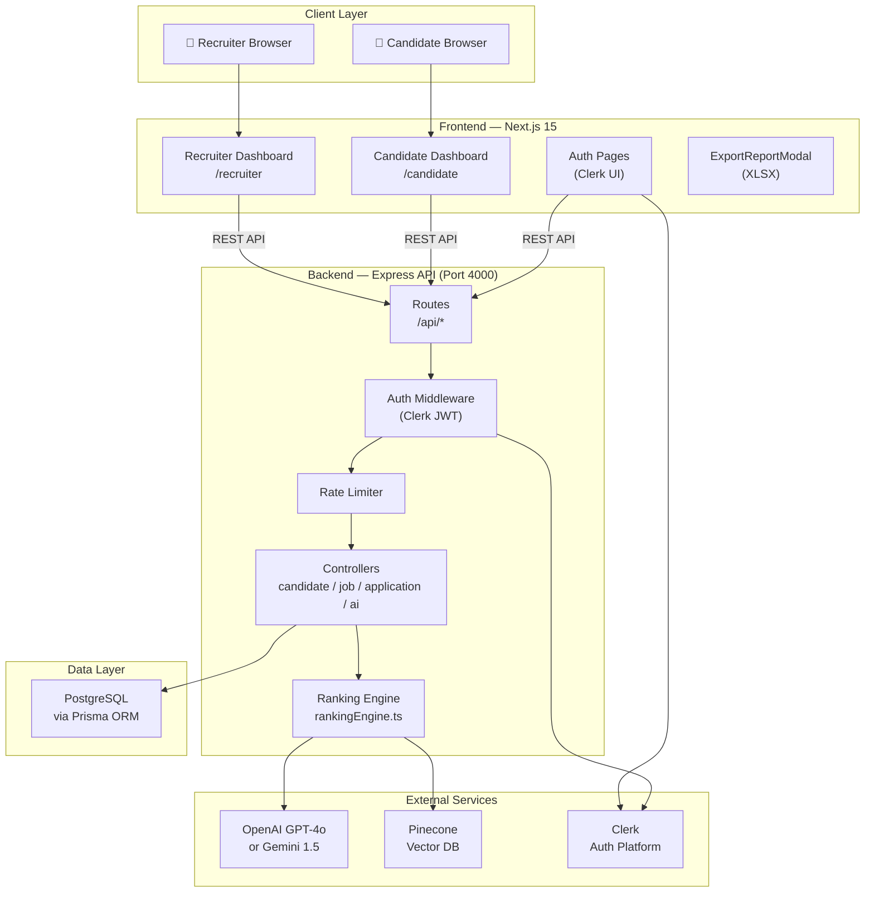
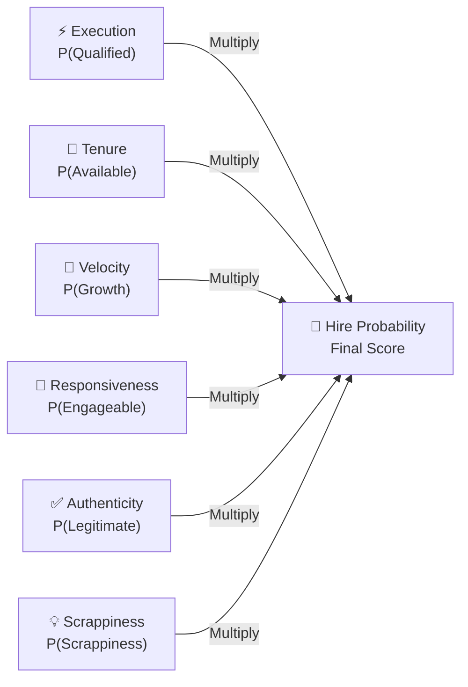
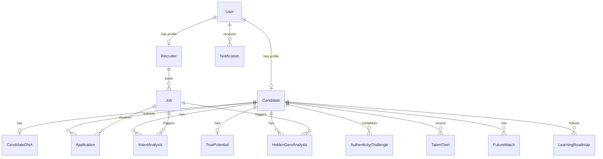
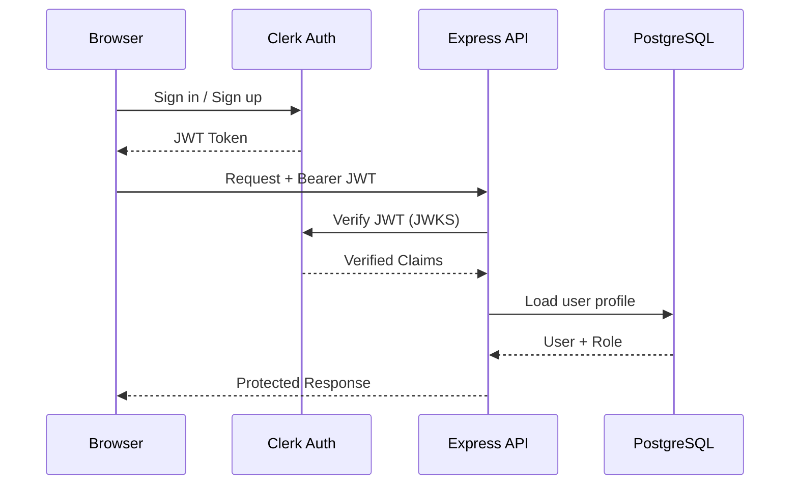
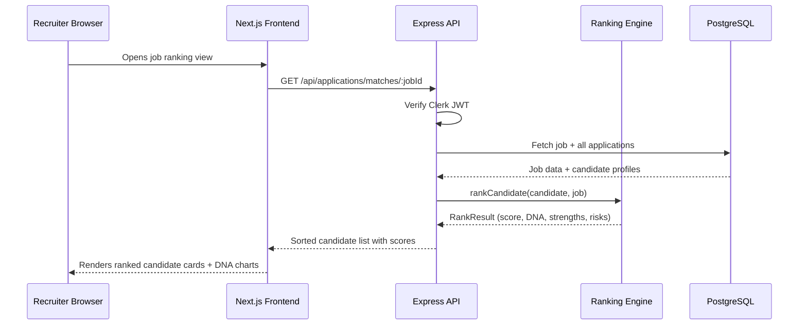
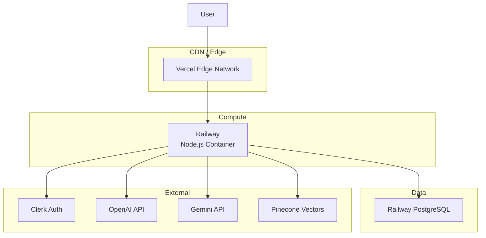

# System Architecture

> **A complete technical map of HireMind Elite's infrastructure, data flow, and system design.**

---

## Table of Contents

- [Overview](#overview)
- [High-Level Architecture](#high-level-architecture)
- [Frontend Layer](#frontend-layer)
- [Backend Layer](#backend-layer)
- [AI Engine Layer](#ai-engine-layer)
- [Database Layer](#database-layer)
- [Ranking Engine](#ranking-engine)
- [Authentication System](#authentication-system)
- [Export System](#export-system)
- [Request Lifecycle](#request-lifecycle)
- [Deployment Architecture](#deployment-architecture)

---

## Overview

HireMind Elite is a **two-tier web application** with a clear separation between presentation, business logic, and data. The system is built to be horizontally scalable, with each service deployable independently.

```
Frontend (Next.js) ←→ Backend API (Express) ←→ Database (PostgreSQL)
                              ↑
                        AI Engine Layer
                     (Gemini / OpenAI / Ranking Engine)
```

---

## High-Level Architecture



---

## Frontend Layer

Built with **Next.js 15** using the **App Router** architecture.

### Key Technologies

| Technology | Version | Purpose |
|---|---|---|
| Next.js | 15.x | React framework with App Router |
| React | 19.x | UI component library |
| TypeScript | 5.x | Type safety |
| Tailwind CSS | 4.x | Utility-first styling |
| Clerk | 6.x | Authentication UI components |
| Framer Motion | 12.x | Animation library |
| GSAP | 3.x | Advanced animations |
| Three.js / R3F | 0.172.x | 3D background effects |
| Lucide React | 0.468.x | Icon library |
| Axios | 1.7.x | HTTP client for API calls |
| ExcelJS | 4.4.x | XLSX report generation |
| Zustand | 5.x | Client-side state management |

### Route Structure

```
frontend/src/app/
├── layout.tsx               # Root layout (Clerk provider, global styles)
├── recruiter/
│   └── page.tsx             # Complete recruiter workspace
└── candidate/
    └── page.tsx             # Candidate profile and job board
```

### Design System

- **Color Scheme**: Dark-first design with glassmorphism panels
- **Typography**: System fonts with custom variable-based spacing
- **Components**: Custom component library built with TailwindCSS v4
- **Animations**: Framer Motion for transitions, GSAP for scroll effects

---

## Backend Layer

Built with **Node.js + Express + TypeScript**, following MVC architecture.

### Directory Structure

```
backend/src/
├── index.ts                 # Server bootstrap, CORS, middleware chain
├── config/
│   └── database.ts          # Prisma client singleton
├── controllers/
│   ├── aiController.ts      # AI endpoint handlers
│   ├── applicationController.ts
│   ├── candidateController.ts
│   └── jobController.ts
├── middleware/
│   ├── auth.ts              # Clerk JWT verification + role injection
│   ├── errorHandler.ts      # Global error catcher
│   └── rateLimiter.ts       # Rate limiting (stricter on AI routes)
├── routes/
│   ├── index.ts             # Route aggregator
│   ├── ai.ts                # /api/ai/* (protected, rate-limited)
│   ├── candidates.ts        # /api/candidates/*
│   ├── jobs.ts              # /api/jobs/* (public GET, protected POST/PUT/DELETE)
│   └── applications.ts      # /api/applications/*
└── services/
    └── rankingEngine.ts     # Core 6-factor scoring engine
```

### Middleware Chain

Every request passes through:

```
Request → CORS → JSON Parser → Routes → Auth Middleware → Controller → Response
                                                ↓ (on error)
                                         Global Error Handler
```

### API Base URL

- **Development**: `http://localhost:4000/api`
- **Production**: `https://your-backend.railway.app/api`

---

## AI Engine Layer

The AI layer is designed as a **pluggable service** — the backend exposes endpoints and the ranking engine performs deterministic scoring, while LLM integrations are added progressively.

### Components

| Component | Status | Technology |
|---|---|---|
| Resume Text Analysis | 🔄 Planned | OpenAI / Gemini |
| Candidate DNA Generation | ⚡ Active (Heuristic) | Custom + LLM |
| Job Intent Analysis | 🔄 Planned | Gemini |
| Hidden Gem Detection | ⚡ Active (Heuristic) | `rankingEngine.ts` |
| Authenticity Challenge | ⚡ Active (Template) | Rule-based |
| Future Role Matching | 🔄 Planned | LLM |
| **6-Factor Ranking Engine** | ✅ Fully Active | Custom TypeScript |

### ETV-RAVE Framework



---

## Database Layer

Uses **PostgreSQL** as the primary data store, managed through **Prisma ORM**.

### Models Overview



See [DATABASE_SCHEMA.md](DATABASE_SCHEMA.md) for full schema documentation.

---

## Ranking Engine

The `rankingEngine.ts` service implements a **deterministic, explainable 6-factor scoring model** entirely in TypeScript, with no external dependencies.

### Scoring Dimensions

| Dimension | Weight | Input Signals |
|---|---|---|
| **Technical Fit** | 35% | Exact + adjacent skill match |
| **Experience Fit** | 20% | Years of experience vs. job title seniority |
| **Career Trajectory** | 10% | Potential score, promotion velocity |
| **Behavioral Intent** | 15% | Activity signals, responsiveness |
| **Credibility** | 10% | Profile completeness, verification status |
| **Hidden Gem** | 10% | Adjacent technology competency, growth indicators |

### Multiplicative Formula

```
Hire Probability = P(Q) × P(A) × P(E) × P(L) × P(G) × P(S)
```

See [SCORING_ENGINE.md](SCORING_ENGINE.md) and [MATCHING_ENGINE.md](MATCHING_ENGINE.md) for full breakdown.

---

## Authentication System

Authentication is powered by **Clerk** — a third-party auth provider.



### Role-Based Access Control

| Role | Permissions |
|---|---|
| `CANDIDATE` | View jobs, apply, manage own profile |
| `RECRUITER` | Post jobs, view all candidates, run rankings |
| `ADMIN` | Full access, user management |

---

## Export System

The export system generates **XLSX reports** from candidate ranking data.

### Libraries

- **Frontend**: `ExcelJS` — generates formatted XLSX in the browser
- **Export Modal**: `ExportReportModal.tsx` — handles column selection and download

### Exported Data

```
Job Title → Candidate List → Rankings → AI Explanations → Download XLSX
```

---

## Request Lifecycle

A typical recruiter triggering candidate ranking:



---

## Deployment Architecture



---

## Related Documentation

- [Data Pipeline](DATA_PIPELINE.md) — Resume-to-ranking full flow
- [AI Engine](AI_ENGINE.md) — LLM prompts and reasoning
- [Database Schema](DATABASE_SCHEMA.md) — Complete table definitions
- [Scoring Engine](SCORING_ENGINE.md) — P-factor scoring model
- [Matching Engine](MATCHING_ENGINE.md) — Semantic matching logic
- [Security](SECURITY.md) — Auth, CORS, secrets
