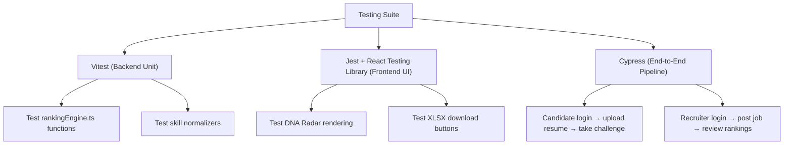

# Testing Guide

> **Guidelines for testing the HireMind Elite platform — covering manual validation, mock data verification, and planned automated test strategies.**

---

## Table of Contents

- [Overview](#overview)
- [Current Testing Strategy](#current-testing-strategy)
- [Manual Testing Workflow](#manual-testing-workflow)
- [Verifying the Scoring Engine](#verifying-the-scoring-engine)
- [API Route Testing](#api-route-testing)
- [UI Verification](#ui-verification)
- [Monorepo Mocking System](#monorepo-mocking-system)
- [Automated Testing Roadmap](#automated-testing-roadmap)

---

## Overview

Quality assurance in HireMind Elite ensures the core **6-factor ranking engine** computes scores accurately, auth boundaries are respected, and XLSX outputs match recruiter criteria.

Since the platform handles candidate evaluation, verification of score outputs is the highest testing priority.

---

## Current Testing Strategy

The repository utilizes a progressive verification pipeline:

```
[Developer Edit] ──> [Manual Controller Tests] ──> [MockData Seeding] ──> [UI Visual Check]
```

At this stage:
- **Unit Logic** is verified manually using the `mockData.js` candidate dataset.
- **End-to-End flows** are verified via simulated UI journeys.
- **Data persistence** is checked via Prisma Studio.

---

## Manual Testing Workflow

### Step 1 — Database Seeding
Ensure the PostgreSQL database contains active structures. Run the seeding process to populate base tables:

```bash
npm run db:generate
npm run db:migrate
```

### Step 2 — Run in Dev Mode
Launch the unified development servers:

```bash
npm run dev
```

### Step 3 — Inspecting Live Data
Open Prisma Studio to inspect raw database states:

```bash
npm run db:studio
```
Prisma Studio opens at `http://localhost:5555`. Verify that `User`, `Job`, `Candidate`, and `Application` tables are populated.

---

## Verifying the Scoring Engine

The scoring engine (`backend/src/services/rankingEngine.ts`) is deterministic, making it straightforward to test with input mocks.

### Testing Scenarios to Validate

Verify these specific conditions in the ranking engine:

| Scenario | Input Profile | Expected Output |
|---|---|---|
| **Perfect Fit** | All skills match exactly; 5+ years experience; verified challenge | Hire Probability: `85% - 98%` |
| **Honeypot stuffing** | Stated skills mirror JD exactly; no other skills | P(Legitimate): `0.10`, final score: `< 10%` |
| **Hidden Gem** | Lacks exact skills, has 2+ adjacent skills; Growth index ≥ 90 | Hidden Gem flag: `true`, final score: `40% - 60%` |
| **Unavailable** | Perfect skills, but brand new job tenure (2 months) | P(Available) low, final score: `< 20%` |

To run scoring validation scripts, execute the scripts inside the `examples/` directory using `tsx`:

```bash
npx tsx examples/test_ranking.ts
```

---

## API Route Testing

Verify API routes using Postman or `curl` commands.

### Auth Route Verification
All endpoints besides job browsing require a Clerk session token. Obtain a token from your Clerk dashboard and include it in your requests:

```bash
curl -H "Authorization: Bearer <token>" http://localhost:5000/api/candidates
```

### Core API Validation Tests

```bash
# Test candidate listing
curl http://localhost:5000/api/candidates

# Test job detail retrieval
curl http://localhost:5000/api/jobs/job-1

# Test application ranking trigger
curl -X POST -H "Content-Type: application/json" \
     -d '{"candidateId":"cand-1", "jobId":"job-1"}' \
     http://localhost:5000/api/ai/rank
```

---

## UI Verification

### Visual Regression Checklist
Verify these elements in the UI:
- **DNA Radar Chart**: Renders correct polygon shape based on the 8 DNA dimensions in `CandidateDNA`.
- **Honeypot Banner**: Shows a red warning banner with a `🚨 CRITICAL` badge when legitimacy drops to `0.10`.
- **Export Modal**: Allows selecting columns, triggers progress slider, and downloads a formatted XLSX file.
- **Challenge Panel**: Submitting answers changes status from `PENDING` to `VERIFIED` on the recruiter view.

---

## Monorepo Mocking System

The file [mockData.js](file:///d:/INDIA.RUNS/mockData.js) provides a pre-configured database of:
- **Jobs** with required skills and match health benchmarks.
- **Candidates** representing different personas (the FAANG superstar, the startup hustler, the hidden gem, the honeypot).
- **Verification challenges** matching specific technologies (React, Go, Python).

Developers can use these mock records to verify that candidate listings match design parameters without making actual API calls.

---

## Automated Testing Roadmap

To transition to production, the following automated testing frameworks are planned for Version 1.0:



---

## Related Documentation

- [Coding Standards](CODING_STANDARDS.md) — Formatting rules
- [System Architecture](../architecture/SYSTEM_ARCHITECTURE.md) — API routing map
- [API Reference](../api/API_REFERENCE.md) — Endpoint inputs and outputs
