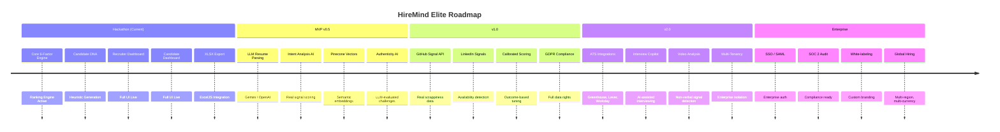

# Future Roadmap

> **HireMind Elite's product evolution — from hackathon prototype to enterprise-grade talent intelligence platform.**

---

## Table of Contents

- [Overview](#overview)
- [Hackathon Version (Current)](#hackathon-version-current)
- [MVP — v0.5](#mvp--v05)
- [Version 1.0](#version-10)
- [Version 2.0](#version-20)
- [Enterprise Tier](#enterprise-tier)
- [ATS Marketplace](#ats-marketplace)
- [Interview Intelligence](#interview-intelligence)
- [Video Analysis Module](#video-analysis-module)
- [Career DNA Evolution](#career-dna-evolution)
- [Global Hiring Platform](#global-hiring-platform)

---

## Overview

---

## Hackathon Version (Current)

**Status**: ✅ Live  
**Target Audience**: Hackathon judges, early adopters, developer community

### What's Live

| Feature | Status | Notes |
|---|---|---|
| 6-Factor Ranking Engine | ✅ Complete | Full TypeScript implementation |
| Candidate DNA Profiler | ✅ Complete | 8-dimension radar chart |
| Recruiter Dashboard | ✅ Complete | Rankings, DNA, export |
| Candidate Dashboard | ✅ Complete | Profile, roadmap, applications |
| Authenticity Challenge | ✅ Complete | Template-based questions |
| Hidden Gem Detection | ✅ Complete | Adjacency-based algorithm |
| Honeypot Detection | ✅ Complete | Pattern-based detection |
| XLSX Export | ✅ Complete | ExcelJS client-side generation |
| PostgreSQL + Prisma | ✅ Complete | Full schema, migrations |
| Clerk Authentication | ✅ Complete | JWT-based RBAC |
| REST API | ✅ Complete | 20+ endpoints documented |

### Known Limitations

- LLM resume parsing returns placeholder data (AI integration pending)
- DNA scores are heuristic (not LLM-generated)
- No real-time GitHub/LinkedIn signal fetching
- Single-tenant only

---

## MVP — v0.5

**Target**: 8–12 weeks post-hackathon  
**Goal**: Replace all placeholder AI calls with real LLM integrations

### Features

#### 🤖 LLM Resume Parsing
- Integrate Gemini 1.5 or GPT-4o for resume extraction
- Structured JSON schema enforcement via XML prompts
- Hallucination prevention through schema validation

#### 🎯 Intent Analysis (Real Signals)
- Candidate profile activity score (last update time)
- Application timing patterns
- Response rate tracking (future)

#### 🔢 Semantic Embeddings
- Integrate OpenAI `text-embedding-ada-002`
- Store candidate and job embeddings in Pinecone
- Enable semantic similarity search beyond keyword matching

#### ✅ LLM Authenticity Evaluation
- AI-scored challenge responses (Gemini / GPT-4o)
- Knowledge confidence scoring per answer
- Automated VERIFIED / FAILED decision

#### 🧬 AI-Generated DNA Briefs
- Natural language narrative for each DNA dimension
- Recruiter brief generated from multi-turn LLM prompt
- Example: *"Ana demonstrates exceptional technical depth with a clear bias toward system architecture..."*

---

## Version 1.0

**Target**: Q1 following MVP  
**Goal**: Production-ready, market-validated platform

### Features

#### 📊 Real-Time Scrappiness Signals
- GitHub API integration: commit frequency, repo stars, PR activity
- Portfolio project scoring
- Certification verification (LinkedIn Learning, Coursera)

#### 📡 Availability Signals
- LinkedIn profile recency detection (career change signals)
- Email open rate tracking (recruiter outreach analytics)
- Job board activity correlation

#### 🎯 Calibrated Scoring
- Outcome-based model calibration using real hiring data
- A/B testing of scoring weights
- Recruiter feedback loop: "Did this hire work out?"

#### 🔒 GDPR Compliance
- Data export API (right to access)
- Account deletion with full audit trail
- Consent management for cookie/analytics

#### 📱 Mobile-Responsive Optimization
- Full responsive design for tablet and mobile
- Progressive Web App (PWA) configuration

#### 🌐 API SDK
- JavaScript/TypeScript SDK for ranking engine
- Python SDK for data science integration
- REST API client library

---

## Version 2.0

**Target**: Q2–Q3 post-MVP  
**Goal**: Market expansion and enterprise readiness

### Features

#### 🔗 ATS Marketplace Integrations
- Greenhouse webhook integration
- Lever API sync
- Workday connector
- Bi-directional candidate sync

#### 🎤 Interview Copilot
- AI assistant for live interview guidance
- Real-time question suggestions based on candidate profile
- Interview notes auto-structured to DNA dimensions
- Post-interview candidate re-scoring

#### 📹 Video Analysis Module (Beta)
- Video interview submission support
- Non-verbal signal detection (attention, confidence)
- Communication dimension enrichment from video

#### 🏢 Multi-Tenancy
- Row-level security for enterprise isolation
- Team workspaces with permission levels
- Custom branding per organization

#### 📊 Advanced Analytics
- Hiring funnel visualization
- Time-to-hire by DNA profile type
- Source-of-hire attribution

---

## Enterprise Tier

**Target**: Post-v2.0  
**Goal**: Fortune 500 adoption

### Features

#### 🔐 SSO / SAML
- Okta, Azure AD, Google Workspace integration
- SCIM provisioning
- Just-in-time user creation

#### 📋 SOC 2 Audit Readiness
- Audit logging for all user actions
- Data lineage tracking
- Security event alerts

#### 🎨 White-Labeling
- Custom logo and color scheme
- Custom domain (e.g., `talent.yourcorp.com`)
- Branded candidate-facing portal

#### 💼 Dedicated Support
- Customer success manager
- SLA-backed response times
- Priority security patching

#### 🌍 Data Residency
- EU data center option (GDPR)
- US data center option
- Customer-managed encryption keys

---

## ATS Marketplace

**Goal**: Position HireMind's 6-factor engine as a scoring layer *inside* existing ATS platforms

### Integrations Planned

| ATS Platform | Integration Type | Timeline |
|---|---|---|
| Greenhouse | Webhook + API | v2.0 |
| Lever | API sync | v2.0 |
| Workday | Connector | Enterprise |
| Ashby | API | v2.0 |
| SmartRecruiters | Webhook | v2.0 |
| SAP SuccessFactors | Enterprise connector | Enterprise |

### Value Proposition

Companies don't need to abandon their current ATS. HireMind becomes a **scoring enrichment layer** that adds hire probability scores, DNA profiles, and AI briefs to existing candidate records.

---

## Interview Intelligence

**Goal**: Extend HireMind from pre-hire ranking to in-process interview support

### Features

- **AI Question Generator**: Auto-generate interview questions based on candidate DNA gaps
- **Live Copilot**: Real-time suggestion drawer during video interviews
- **Notes Structurer**: Convert free-form interview notes to structured DNA scores
- **Candidate Re-Scorer**: Update hire probability after interview feedback
- **Interview Scheduler**: Calendar integration for seamless booking

---

## Video Analysis Module

**Goal**: Add non-verbal signal detection to the candidate evaluation stack

### Capabilities

- **Communication Analysis**: Tone, articulation, pacing
- **Confidence Signals**: Eye contact, posture (from video)
- **Authenticity Check**: Stress signals, hedging language
- **Integration**: Feeds `communication` and `authenticity` DNA dimensions

> **Note**: This feature will be implemented with explicit candidate consent and will be clearly disclosed in the candidate UI. Privacy-first by design.

---

## Career DNA Evolution

**Goal**: Transform DNA from a static snapshot to a live career intelligence feed

### Enhancements

- **Time-series DNA**: Track how dimensions change over months/years
- **DNA Percentiles**: Show how a candidate ranks vs. the talent market
- **Peer Benchmarking**: Compare DNA to successful hires in similar roles
- **Learning Impact**: Measure how completed roadmap milestones improve DNA scores
- **Career Coach Mode**: AI chat assistant that explains DNA and recommends next steps

---

## Global Hiring Platform

**Goal**: Support international hiring across geographies, currencies, and compliance frameworks

### Features

- **Multi-Currency Salary Ranges**: USD, EUR, INR, GBP, AUD
- **Location Intelligence**: Cost-of-living adjusted compensation benchmarks
- **Compliance Templates**: Country-specific hiring legal templates
- **Work Authorization Signals**: Visa status integration
- **Language Support**: Multi-language candidate interface (Hindi, Spanish, French, German)
- **Tax Jurisdiction**: Contractor vs. employee classification by region

---

## Related Documentation

- [Product Overview](PRODUCT_OVERVIEW.md) — Current capabilities
- [Features](FEATURES.md) — Live feature breakdown
- [Changelog](../development/CHANGELOG.md) — Version history
- [Architecture](../architecture/SYSTEM_ARCHITECTURE.md) — Technical foundation for scaling
