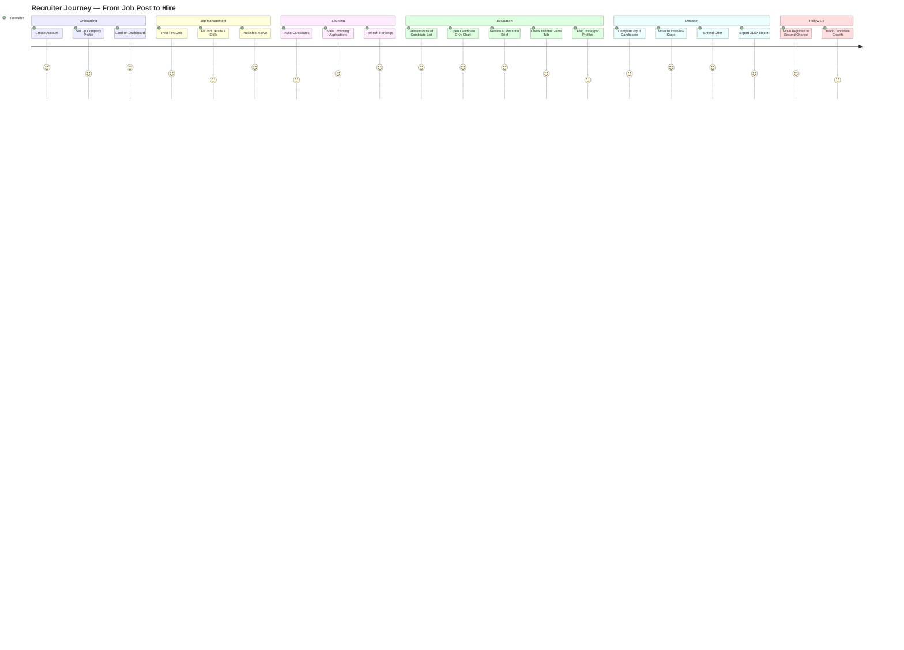
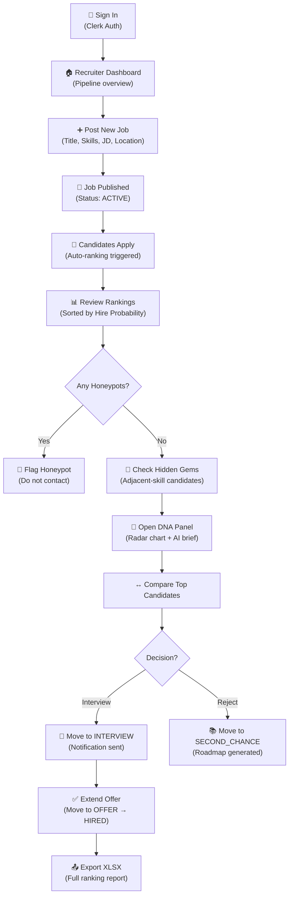
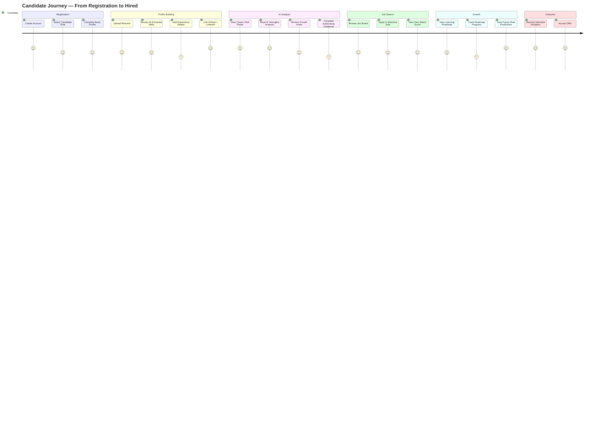
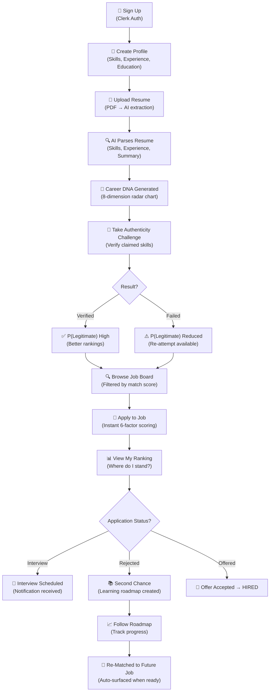
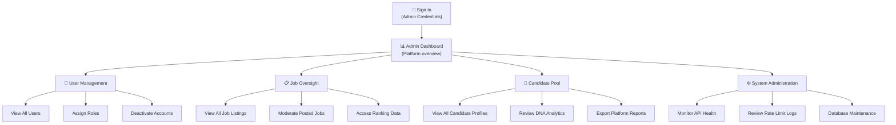
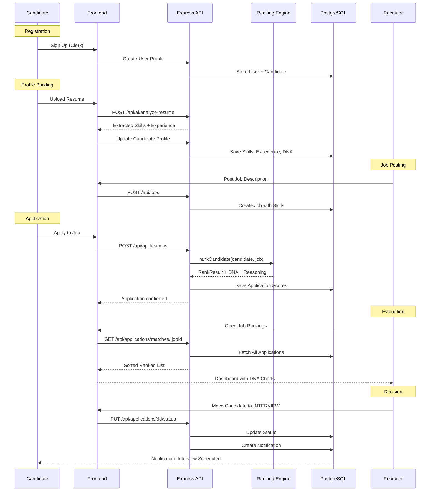

# User Journey Maps

> **Visual step-by-step journeys for every user type in HireMind Elite.**

---

## Table of Contents

- [Recruiter Journey](#recruiter-journey)
- [Candidate Journey](#candidate-journey)
- [Admin Journey](#admin-journey)
- [End-to-End Hiring Flow](#end-to-end-hiring-flow)

---

## Recruiter Journey

### Detailed Recruiter Workflow

---

## Candidate Journey

### Detailed Candidate Workflow

---

## Admin Journey

---

## End-to-End Hiring Flow

The complete interaction between all system actors:

---

## Journey Summary

| Journey | Key Decision Points | AI Touchpoints |
|---|---|---|
| **Recruiter** | Post job, review rankings, shortlist, extend offer | Hidden gem detection, DNA generation, honeypot alerts |
| **Candidate** | Build profile, take challenge, apply, track status | Resume parsing, DNA analysis, authenticity challenge, roadmap |
| **Admin** | User management, platform oversight | Platform health monitoring |

---

## Related Documentation

- [Recruiter Guide](RECRUITER_GUIDE.md) — Detailed recruiter workflow
- [Candidate Guide](CANDIDATE_GUIDE.md) — Detailed candidate workflow
- [Features](FEATURES.md) — Feature-by-feature breakdown
- [Data Pipeline](../architecture/DATA_PIPELINE.md) — Technical pipeline behind each step
